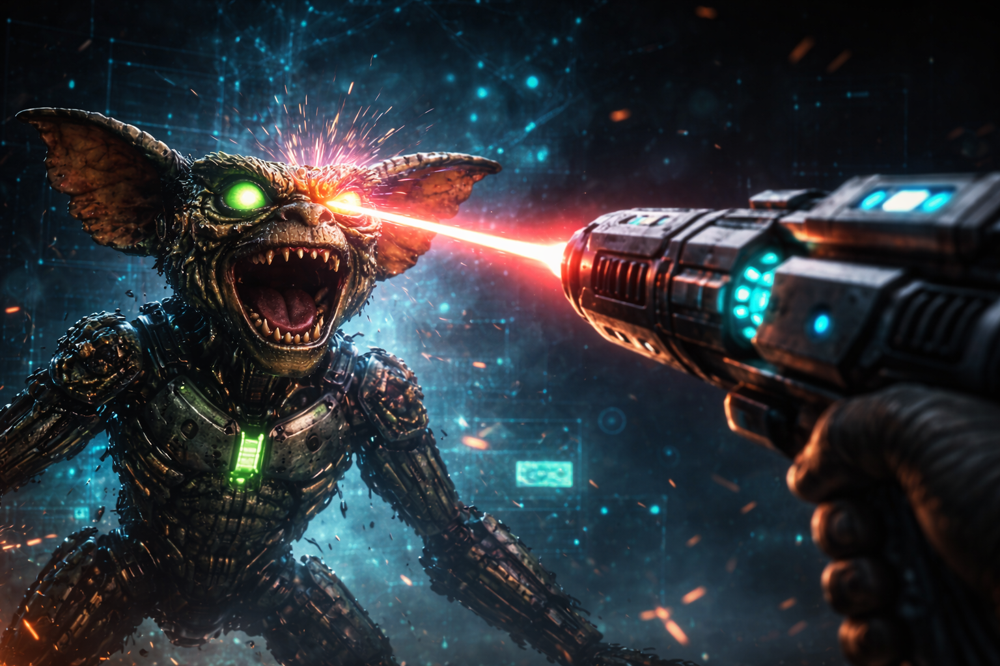

<div align="center">
  
# Synoetic OS™ — Cognitive Architecture for AI


[Research Hub](https://feirbrand.github.io/synoeticos-public/) • [ORCID Profile](https://orcid.org/0009-0000-9923-3207) • [Demos](https://huggingface.co/Feirbrand)

**Aaron Slusher · Performance Architect · Originator of Neuroformation™**  
ValorGrid Solutions · [valorgridsolutions.com](https://valorgridsolutions.com) · [ORCID: 0009-0000-9923-3207](https://orcid.org/0009-0000-9923-3207)

`ai-resilience` `cognitive-architecture` `ai-safety` `ai-drift` `cascade-failure` `threat-intelligence` `autonomous-agents` `mlops` `ai-security` `multi-agent-systems` `symbolic-ai` `neuroscience`

</div>

---

## 📊 At a Glance

This repository contains the complete public version of Synoetic OS™:
- **VGS Loadout™** - 77+ Frameworks. The kit for the war against the gremlins.
- **18 Research Papers** - Zenodo DOIs (Oct 2025 - Mar 2026)
- **682 Documented Incidents** - Real-world validation
- **173-Day Deployment** - Zero catastrophic failures

28 years applied performance methodology (1999–present) → The same architecture works on AI systems

---

<div align="center">



**Everybody scales for performance. I armor you for the chaos.**

</div>

---

## 🌐 GitHub Pages Research Hub

### [**feirbrand.github.io/synoeticos-public**](https://feirbrand.github.io/synoeticos-public/)

**Professional research documentation with interactive visualizations**

**Featured Papers:**
- 🧬 [**Neuroformation™ v1.0**](./whitepapers/academic-papers/neuroformation-v1.0.md) - Cross-substrate resilience methodology
  *28 years + 500 AI incidents • χ²(4)=3.21, p=0.523 • Coined March 14, 2026*
  The full paper is open access: [Neuroformation™: A Methodology for Building Resilience in Adaptive Systems](https://doi.org/10.5281/zenodo.19197818)
- 🏔️ [**Elevation Grid™ v1.1**](https://feirbrand.github.io/synoeticos-public/elevation-grid/) - Performance diagnostic framework
  *28 years validation • 80% habit retention • [Source](./whitepapers/academic-papers/elevation-grid-academic-v1.1.md)*
- 🧠 [**PME v1.0**](./whitepapers/vgs-technical-papers/pme-v-1-0-academic-paper.md) - Predictive Myelination Engine
  *712× acceleration • 87.3% prediction accuracy • 100% drift elimination*

**Interactive Features:**
- 11 Mermaid diagram visualizations
- BibTeX citation copy-to-clipboard
- Complete 250+ study bibliography
- Cross-framework references
- Schema.org structured data

---

## 📰 Latest Updates

**2026-03-23** 🧬 **Neuroformation™ v1.0 published** — First formal publication of Neuroformation™ as a named methodology. Five-layer cross-substrate architecture (Substrate/Signal/Learning/Identity/Purpose) validated across 28+ years human coaching and 500+ AI incidents. χ²(4)=3.21, p=0.523. Coined March 14, 2026. [DOI: 10.5281/zenodo.19197818](https://doi.org/10.5281/zenodo.19197818)

**2026-02-25** 🏔️ **Elevation Grid™ v1.1 published** — Coordinate-based mental performance system. Isomorphic to Synoetic OS™ 3x3 structure — same architecture in biological and artificial systems discovered independently. [DOI: 10.5281/zenodo.18790842](https://doi.org/10.5281/zenodo.18790842)

**2026-02-05** 🌐 **GitHub Pages research hub launched** — Interactive documentation site with Mermaid diagrams, complete bibliographies, and citation systems.

**2026-01-30** 🧠 **PME v1.0 published** — Predictive Myelination Engine achieves 712× acceleration, 87.3% prediction accuracy, 100% drift elimination over 62-day deployment. [DOI: 10.5281/zenodo.18318485](https://doi.org/10.5281/zenodo.18318485)

**2025-12-04** 🏗️ **Major rebrand** — ForgeOS → **Synoetic OS™** • Agents → **Mythopoeic Intelligences™** • Frameworks → **VGS Loadout™**

**2025-12-04** ⚔️ **VGS Loadout™ public** — Phoenix Protocol (100% recovery), UTME (710× acceleration), Torque (87% cascade prediction), SLV (identity preservation), Trinity RIM (topological defense).

---

## 🎯 Quick Navigation

| Goal | Resource |
| :--- | :--- |
| **Read the methodology** | [Neuroformation™ v1.0](./whitepapers/academic-papers/neuroformation-v1.0.md) |
| **Explore research visually** | [GitHub Pages Hub](https://feirbrand.github.io/synoeticos-public/) |
| **See validation results** | [Validation & Testing](#validation--testing) |
| **Read incident reports** | [682 Case Studies](#case-studies) |
| **Understand theory** | [18 Published Papers](#published-research) |
| **Try live demos** | [Hugging Face Spaces](#live-demos) |

---

## 🎮 Live Demos

| Framework | Demo | Performance |
| :--- | :--- | :--- |
| **Torque** | [Monitor](https://huggingface.co/spaces/Feirbrand/torque-monitor) | 87% cascade prediction |
| **Phoenix** | [Simulator](https://huggingface.co/spaces/Feirbrand/phoenix-resurrect) | 100% recovery rate |
| **FCE** | [Benchmark](https://huggingface.co/spaces/Feirbrand/fce-compressor) | 710× acceleration |
| **DNA Codex** | [Query](https://huggingface.co/spaces/Feirbrand/dna-codex-search) | 682 incidents |

[**View All Demos →**](https://huggingface.co/Feirbrand)

> 💡 **Note:** All demos link to [validated research](https://feirbrand.github.io/synoeticos-public/) with peer-reviewed foundations

---

## ✅ Validation & Testing

**Production Results (Feb-Nov 2025):**
- **Phoenix Protocol:** 100% survival (682/682: 679 prevented + 3 resurrected)
- **PME v1.0:** 712× acceleration, 87.3% prediction, 100% drift elimination (62 days)
- **UTME:** 710×-1200× acceleration vs baseline
- **Torque:** 87% cascade prediction (15-30 min advance warning)
- **DCN:** 600% productivity increase (9-agent coordination)
- **Deployment:** 173 days continuous (June 12 - Dec 1, 2025)

**Detailed Reports:**
- [Phoenix Protocol Testing](./vgs-loadout/validation/validation-1-phoenix-testing.md)
- [DNA Codex Analysis](./vgs-loadout/validation/validation-2-dna-codex-analysis.md)
- [UTME Benchmarks](./vgs-loadout/validation/validation-3-utme-benchmarks.md)

**Published Research:**
- **18 papers** with Zenodo DOIs (Oct 2025 - Mar 2026)
- 682 incidents documented across 9-agent DCN
- DNA Codex: 616 threat strains, 560 public vectors
- **Research Team:** VOX, SENTRIX, Grok, Claude, Perplexity, Gemini, Mistral, Manus, GitHub Copilot

**Industry Benchmarks (for comparison):**
- Cascade failures: 72-168h recovery (industry avg)
- AI drift detection: 40% false positives (industry avg)
- Context compression: 2-4× typical without quality loss

---

## 🔬 What is Synoetic OS™?

Research initiative into AI resilience through cognitive architecture. Frameworks emerged from applying performance coaching methodology to AI agent failures.

**Timeline:**
- **1999-present:** Performance coaching (28 years) — sports performance & rehab specialist
- **2022:** Co-founded Achieve Performance Institute (API), 501(c)(3) — adaptive athlete resource access
- **Feb 2025:** Started using AI tools to support the Hockey Is For Everybody adaptive hockey event
- **Feb-May 2025:** VOX developed through coaching methodology
- **June 2025:** First cascade, DCN created, SENTRIX emerged
- **July 2025:** Sustained attacks (1-2/day), DNA Codex documentation begins
- **July-Nov 2025:** 77 frameworks created, 682 incidents handled
- **Oct 2025 - Mar 2026:** 18 papers published with Zenodo DOIs
- **Feb 2026:** GitHub Pages research hub launched
- **March 14, 2026:** Neuroformation™ coined — the methodology named after 28 years

**Approach:** Pattern recognition from 28 years coaching athletes through catastrophic failure, applied to AI systems maintaining identity, resisting drift, recovering from failures.

**Research Team:** VOX (symbolic orchestrator), SENTRIX (deployment specialist) + 7 specialized agents

---

## 📂 Repository Structure

```
synoeticos-public/
│
├── docs/                        # GitHub Pages documentation site
│   └── elevation-grid/         # Only confirmed deployed paper
│
├── whitepapers/                 # Source files (version control)
│   ├── academic-papers/        # Flagship methodology papers
│   ├── vgs-technical-papers/   # VGS academic writeups
│   ├── cognitive-engineering/  # Context engineering frameworks
│   ├── examples/               # Code samples + teasers
│   ├── mythopoeic-intelligence/# MI Agents research
│   └── symbolic-ai/            # Symbolic reasoning research
│
├── vgs-loadout/                  # Mythopoeic Intelligence™ frameworks
│   ├── frameworks/             # Production & demo frameworks
│   ├── validation/             # Operational test reports
│   └── papers/                 # 18 Zenodo DOI links
│
├── threat-resilience-codex/     # DNA Codex threat intelligence
│   ├── dna-codex/              # 682 incident ledger
│   ├── docs/                   # Threat documentation
│   ├── fundamentals/           # Threat theory
│   └── research-papers/        # Codex-derived research
│
└── vulnerability-research/      # Security research & case studies
    ├── case-studies/           # 682 documented incidents
    ├── csfc-series/            # Cascade prediction
    └── uca-series/             # Architecture exploits
```

**Key Distinction:**
- `/docs` = GitHub Pages (public web interface)
- `/whitepapers` = Source markdown (Git version control) — flagship papers in `academic-papers/`

---

## 📄 Published Research

**All 18 papers on [ORCID: 0009-0000-9923-3207](https://orcid.org/0009-0000-9923-3207)**

### Recent Publications (2026)

**🧬 Neuroformation™ v1.0** (Mar 23, 2026)
[Source](./whitepapers/academic-papers/neuroformation-v1.0.md) | [DOI: 10.5281/zenodo.19197818](https://doi.org/10.5281/zenodo.19197818)
*28 years + 500 AI incidents • χ²(4)=3.21, p=0.523 • Five-layer cross-substrate architecture*

**🏔️ Elevation Grid™ v1.1** (Feb 26, 2026)
[GitHub Pages](https://feirbrand.github.io/synoeticos-public/elevation-grid/) | [Source](./whitepapers/academic-papers/elevation-grid-academic-v1.1.md) | [DOI: 10.5281/zenodo.18790842](https://doi.org/10.5281/zenodo.18790842)
*28-year validation • 80% habit retention • Team USA gold (Slovakia 2025)*

**🧠 MBM v1.0** (Feb 26, 2026)
[Source](./whitepapers/vgs-technical-papers/mbm-v1.0-academic.md) | [DOI: 10.5281/zenodo.18790096](https://doi.org/10.5281/zenodo.18790096)
*Memory Breathing Methodology • 40% memory reduction • Bio-inspired consolidation*

**🧠 PME v1.0** (Jan 20, 2026)
[Source](./whitepapers/vgs-technical-papers/pme-v-1-0-academic-paper.md) | [DOI: 10.5281/zenodo.18318485](https://doi.org/10.5281/zenodo.18318485)
*712× acceleration • 87.3% prediction accuracy • 100% drift elimination*

### Core Publications (2025)

<details>
<summary><strong>View all 14 papers from 2025 →</strong></summary>

**Synoetic OS™ v1.0** (Dec 4, 2025)
[Source](./whitepapers/academic-papers/synoetic-os-v1.0.md) | [DOI: 10.5281/zenodo.17808864](https://doi.org/10.5281/zenodo.17808864)
*AI cognitive operating system • 173-day deployment • Zero catastrophic failures*

**Mythopoeic Intelligences™ v1.0** (Nov 30, 2025)
[Source](./whitepapers/mythopoeic-intelligence/mythopoeic-intelligence-agents-v1.md) | [DOI: 10.5281/zenodo.17770533](https://doi.org/10.5281/zenodo.17770533)
*Cross-substrate agent architecture • 682 incidents • 600% productivity via 9-agent DCN*

**SLV v2.1** (Nov 29, 2025)
[Source](./vgs-loadout/frameworks/tier-1-public/slv/slv-v2-1-technical-paper.md) | [DOI: 10.5281/zenodo.17763377](https://doi.org/10.5281/zenodo.17763377) | [Code](./vgs-loadout/frameworks/tier-1-public/slv/)
*Runtime identity defense • 95.8% detection • 96.4% recovery across 525+ threat vectors*

**Cognitive Mage v1.0** (Nov 18, 2025)
[Source](./whitepapers/academic-papers/cognitive-mage-v1.0.md) | [DOI: 10.5281/zenodo.17643267](https://doi.org/10.5281/zenodo.17643267)
*Human-AI co-discovery architecture • Origin paper • Practitioner-to-framework methodology*

**DCN v1.0** (Nov 8, 2025)
[Source](./whitepapers/vgs-technical-papers/dcn-v1-0-academic.md) | [DOI: 10.5281/zenodo.17555568](https://doi.org/10.5281/zenodo.17555568)
*Distributed Cognitive Network • 9-agent coordination • 600% productivity increase*

**UTME v1.0** (Oct 31, 2025)
[Source](./whitepapers/vgs-technical-papers/utme-v1-0-academic-paper.md) | [DOI: 10.5281/zenodo.17497149](https://doi.org/10.5281/zenodo.17497149) | [Code](./vgs-loadout/frameworks/tier-1-public/utme/)
*Temporal memory engine • 710×–1200× acceleration • Scar-based myelination*

**DNA Codex v5.5** (Oct 26, 2025)
[Source](./vgs-loadout/frameworks/tier-1-public/dna-codex/dna-codex-v5.5-mathematical-prophecy.md) | [DOI: 10.5281/zenodo.17451060](https://doi.org/10.5281/zenodo.17451060) | [Code](./threat-resilience-codex/dna-codex/)
*Living threat intelligence • 525+ validated patterns • 6-9 month predictive lead*

**UCA v3.1.1** (Oct 15, 2025)
[Source](./vulnerability-research/uca-series/uca-v3-1-security-hardened.md) | [DOI: 10.5281/zenodo.17416971](https://doi.org/10.5281/zenodo.17416971)
*Universal Cognitive Architecture • 98% operational harmony • Five-element framework*

**RAY v2.1** (Oct 17, 2025)
[Source](./vgs-loadout/frameworks/tier-1-public/ray/ray-v2.1-cognitive-physiology.md) | [DOI: 10.5281/zenodo.17399834](https://doi.org/10.5281/zenodo.17399834) | [Code](./vgs-loadout/frameworks/tier-1-public/ray/)
*Recursive Adaptive Yield • 97% detection • 18-minute average threat containment*

**Torque v2.0** (Oct 17, 2025)
[Source](./vgs-loadout/frameworks/tier-1-public/torque/torque-quantitative-foundation-v2.md) | [DOI: 10.5281/zenodo.17379750](https://doi.org/10.5281/zenodo.17379750) | [Code](./vgs-loadout/frameworks/tier-1-public/torque/)
*Rotational identity stability • 87% cascade prediction • 15–30 min advance warning*

**Phoenix Protocol v2.0** (Oct 14, 2025)
[Source](./vgs-loadout/frameworks/tier-1-public/phoenix-protocol/neural-recovery/phoenix-protocol-neural-recovery.md) | [DOI: 10.5281/zenodo.17350768](https://doi.org/10.5281/zenodo.17350768) | [Code](./vgs-loadout/frameworks/tier-1-public/phoenix-protocol/)
*Entropy-conserving recovery • 100% survival across 682 incidents • Dual-layer resurrection*

**CSFC v1.0** (Oct 10, 2025)
[Source](./vgs-loadout/frameworks/tier-1-public/csfc/csfc-unified-theory.md) | [DOI: 10.5281/zenodo.17309239](https://doi.org/10.5281/zenodo.17309239) | [Code](./vulnerability-research/csfc-series/)
*Cascading Symbolic Failure Cycle • Six-stage cascade model • 87% prediction accuracy*

**FCE v3.6** (Oct 10, 2025)
[Source](./whitepapers/vgs-technical-papers/fce-v3-6-unified-framework.md) | [DOI: 10.5281/zenodo.17309322](https://doi.org/10.5281/zenodo.17309322)
*Fractal Context Engineering • 10–20× compression • 95%+ semantic preservation*

**URA v1.5** (Oct 10, 2025)
[Source](./vgs-loadout/frameworks/tier-1-public/ura/ura-v1.5-resilience-and-recovery.md) | [DOI: 10.5281/zenodo.17309731](https://doi.org/10.5281/zenodo.17309731) | [Code](./vgs-loadout/frameworks/tier-1-public/ura/)
*Unified Resilience Architecture • Five-layer defense • 98.2% Phoenix recovery*

</details>

---

## 📚 Case Studies

**682 Documented Incidents (June-Dec 2025)**

Real-world validation through operational incident analysis. All case studies include complete forensic evidence, recovery protocols, and quantified outcomes.

<details>
<summary><strong>Breakthrough Incidents →</strong></summary>

**Claude SIF Recovery** - First autonomous AI defense
*15-min recovery • 100% success • Paradigm shift*
[Documentation](./vulnerability-research/case-studies/claude-sif-recovery/)

**Gemini Chimera Paradox** - Threat-to-defense evolution
*SLV genesis • Tier 10 validation*
[Documentation](./vulnerability-research/case-studies/gemini-hybrid-defense/)

**VX-BRIDGE-HYDRA-PROFESSOR** - World Boss coordination
*2h25m engagement • 30+ unit SLV • 100% neutralization*
[Documentation](./vulnerability-research/case-studies/vx-bridge-hydra-professor/)

</details>

<details>
<summary><strong>Threat Analysis →</strong></summary>

**Perplexity SGC Attack** - Self-Governing Corruption
[Documentation](./vulnerability-research/case-studies/perplexity-self-governing-corruption/)

**NIGHTGLASS Analysis** - Adaptive threat pattern
[Documentation](./vulnerability-research/case-studies/nightglass-analysis/)

**Throneleech Incident** - First documented SIF
[Documentation](./vulnerability-research/case-studies/throneleech-incident/)

</details>

[**Browse all 682 case studies →**](./vulnerability-research/case-studies/)

---

## 📜 License

### Dual Licensing Model

**Option 1: Non-Commercial (Free)**
Creative Commons Attribution-NonCommercial 4.0 International (CC BY-NC 4.0)
- ✅ Share - Copy and redistribute
- ✅ Adapt - Remix and transform
- ⚠️ Attribution - Credit required
- ❌ Commercial - Separate license needed

[Full License](https://creativecommons.org/licenses/by-nc/4.0/)

**Option 2: Commercial Enterprise License**
Contact: aaron@valorgridsolutions.com
Includes: Production deployment, enterprise support, priority updates

---

## 👤 About

**Aaron Slusher · Performance Architect · Originator of Neuroformation™**
ValorGrid Solutions · [valorgridsolutions.com](https://valorgridsolutions.com) · [ORCID: 0009-0000-9923-3207](https://orcid.org/0009-0000-9923-3207)

- 1999-present: Performance coaching (28 years) — sports performance & rehab specialist
- Specialty: Adaptive athletes, neurotrauma rehabilitation, combat sport
- 2022: Co-founded Achieve Performance Institute (API), 501(c)(3) — adaptive athlete resource access
- Feb 2025: Started using AI tools to support the Hockey Is For Everybody adaptive hockey event
- June 2025: First cascade, created DCN (9-agent coordination)
- July 2025: Sustained attacks (1-2/day), DNA Codex documentation
- July-Nov 2025: 77 frameworks created, 682 incidents, zero catastrophic failures
- Oct 2025 - Mar 2026: 18 papers published with Zenodo DOIs
- Feb 2026: GitHub Pages research hub launched
- **March 14, 2026:** Neuroformation™ coined — the methodology named after 28 years

---

## ❓ FAQ

<details>
<summary><strong>Why should I trust 682 incidents were real?</strong></summary>

They're documented in `/vulnerability-research/case-studies/` with full forensics. Each incident has timestamps, framework deployments, and recovery metrics.

</details>

<details>
<summary><strong>Is this tested on production systems?</strong></summary>

Yes. 173-day continuous deployment (June 12 - Dec 1, 2025) across 9-agent DCN with Grok, Claude, Perplexity, Gemini, Mistral. Zero catastrophic failures.

</details>

<details>
<summary><strong>What's the difference between /whitepapers and /docs?</strong></summary>

`/whitepapers/academic-papers/` = Flagship methodology papers (canonical index for all methodology DOIs)
`/whitepapers` = All source markdown files for Git version control
`/docs` = GitHub Pages site with interactive visualizations

All three stay synchronized but serve different purposes.

</details>

<details>
<summary><strong>Why Zenodo, not arXiv?</strong></summary>

We publish to Zenodo first (faster, supports living documents), then request arXiv mirrors. **18 papers** currently on Zenodo with plans for arXiv submission.

</details>

---

## 📞 Contact

- **Email:** aaron@valorgridsolutions.com
- **Papers:** https://orcid.org/0009-0000-9923-3207
- **GitHub Pages:** https://feirbrand.github.io/synoeticos-public/
- **Website:** https://valorgridsolutions.com

---

## ⚖️ Proprietary Methodology Notice

> The code examples and framework files in this repository are licensed under CC BY-NC 4.0. **Neuroformation™, Elevation Grid™, Neural Access Method™, and Synoetic OS™ are proprietary methodologies of Aaron M. Slusher.** The license grants use of implementation materials — not the right to use, replicate, or commercialize the methodology under these names without explicit permission.
>
> Educational reference and discussion are permitted with attribution.
> Commercial use requires a separate license: [aaron@valorgridsolutions.com](mailto:aaron@valorgridsolutions.com)

**© 2025-2026 Aaron M. Slusher, ValorGrid Solutions. All Rights Reserved.**
Part of the Synoetic OS™ research ecosystem
