# ELEVATION GRID - DATA VISUALIZATIONS

## 1. THE 3×3 GRID SYSTEM

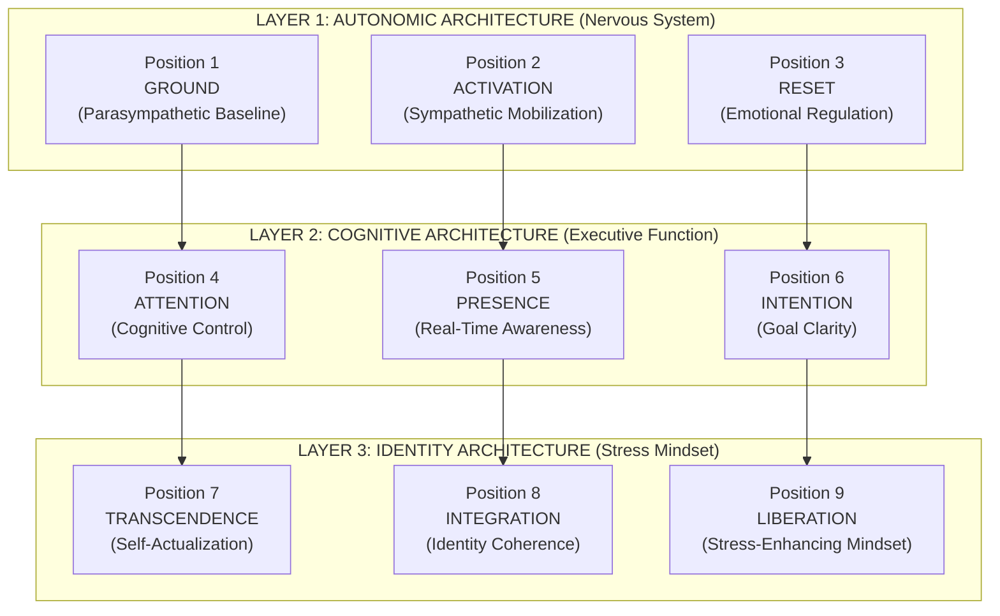

---

## 2. BANDWIDTH CONSTRAINT: SENSORY INPUT VS CONSCIOUS PROCESSING

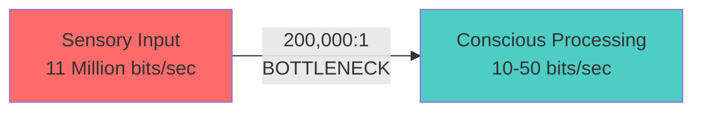

**Visual Chart:**
```
Sensory Processing Capacity:  ████████████████████████████████████████ 11,000,000 bits/sec
                              
Conscious Processing Capacity: ▓ 50 bits/sec
                              
Ratio: 220,000:1 bottleneck
```

---

## 3. RESPONSE SPEED GAP: AMYGDALA VS PREFRONTAL CORTEX

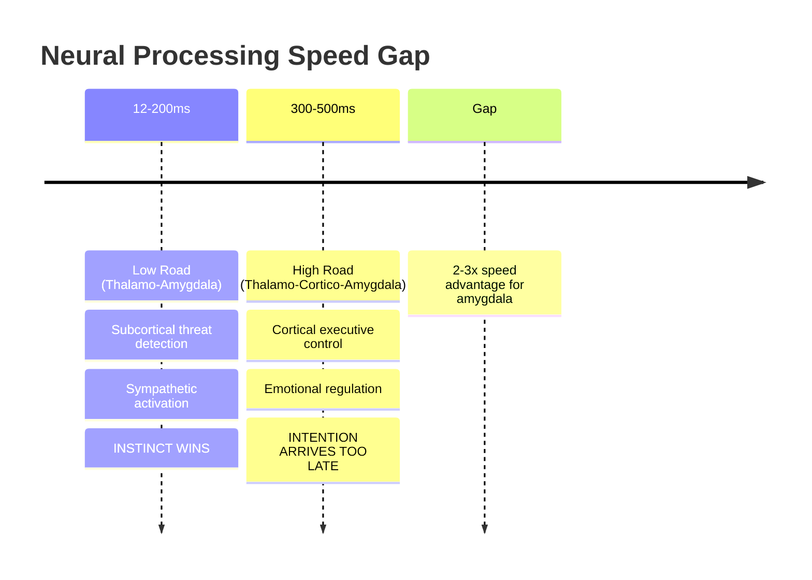

**Timeline Visualization:**
```
Time (milliseconds)
0ms ────────────────────────────────────────────────────────────────────
    │
    ├─ 12-200ms: AMYGDALA THREAT RESPONSE
    │            └─ Sympathetic activation
    │            └─ Fight/Flight/Freeze
    │
    ├─ 300-500ms: PREFRONTAL CORTEX RESPONSE
    │             └─ Executive decision
    │             └─ Emotional regulation
    │
    └─ GAP: Amygdala wins 2-3x faster
```

---

## 4. POLYVAGAL THEORY: THREE-TIER AUTONOMIC HIERARCHY

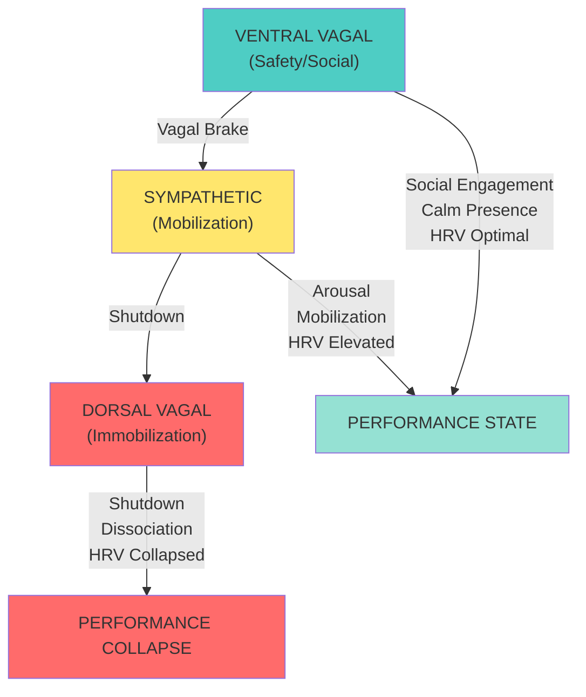

---

## 5. MOTOR LEARNING STAGES: PROCEDURAL MEMORY ACCESS

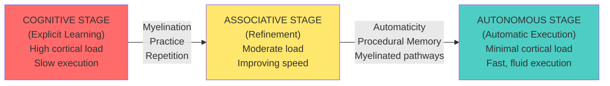

---

## 6. TEMPORAL CONSTRAINTS: BANDWIDTH HIERARCHY

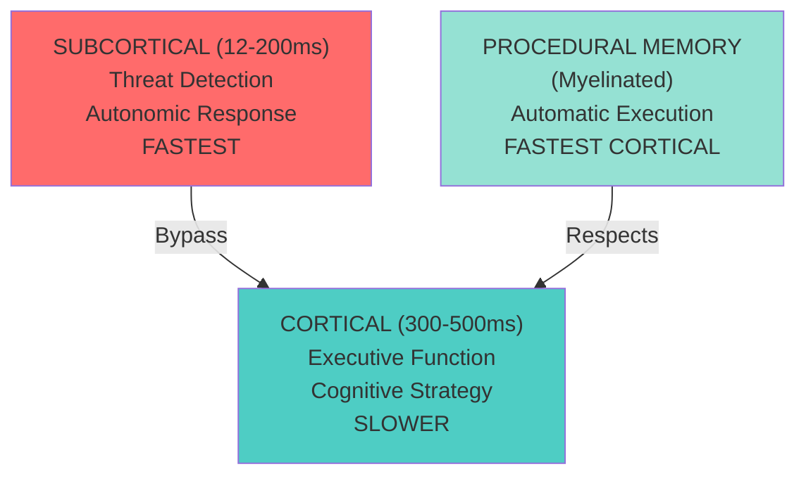

---

## 7. ELEVATION GRID: BOTTOM-UP PROGRESSION

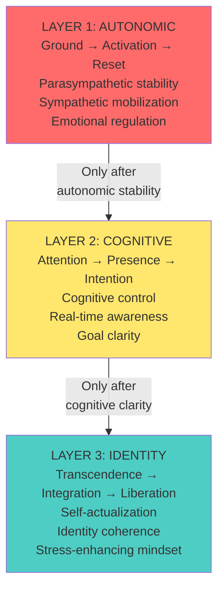

---

## 8. NEURAL ACCESS METHOD (NAM): 4-STEP PROTOCOL

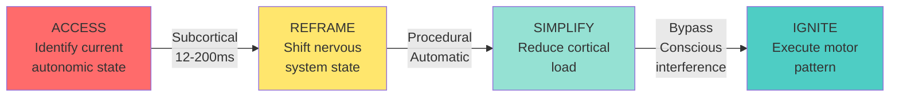

---

## 9. HABIT RETENTION: ELEVATION GRID VS INDUSTRY BASELINE

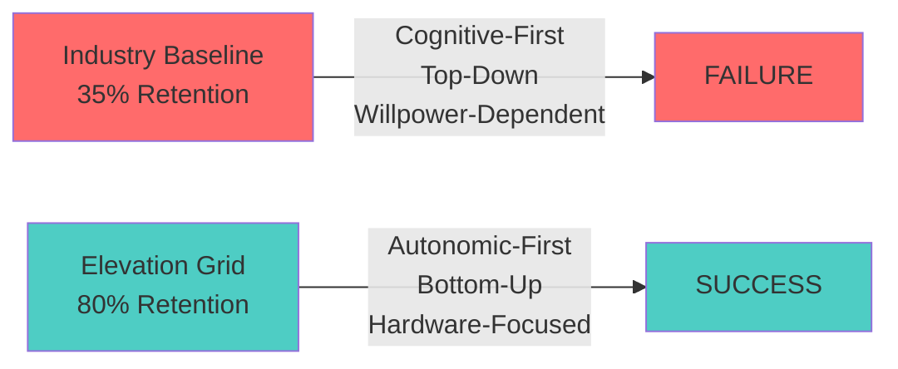

**Retention Comparison Chart:**
```
Elevation Grid:    ████████████████████████████████████████ 80%
Industry Baseline: ███████████████ 35%
                   
Improvement: +45 percentage points (128% increase)
```

---

## 10. FIELD VALIDATION: 28-YEAR OUTCOMES

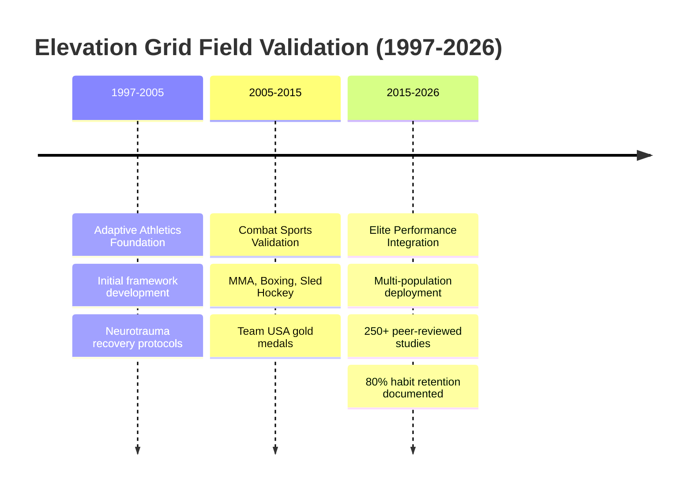

---

## 11. RESEARCH VALIDATION: PEER-REVIEWED SOURCES

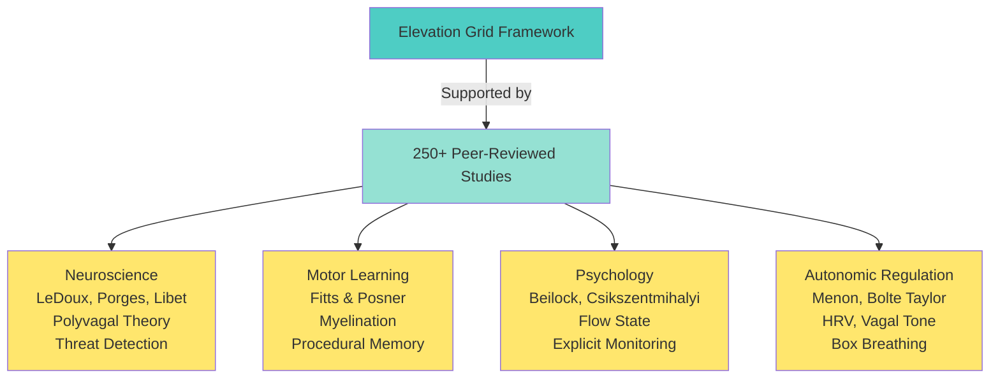

---

## VISUALIZATION EXPORT FORMATS

**For GitHub Pages:** Interactive Mermaid diagrams (auto-render)  
**For Medium/Substack:** PNG exports (static images)  
**For Academic Paper:** High-res SVG (publication quality)

---

**All visualizations are ready for insertion into the Elevation Grid paper and GitHub Pages site.**
