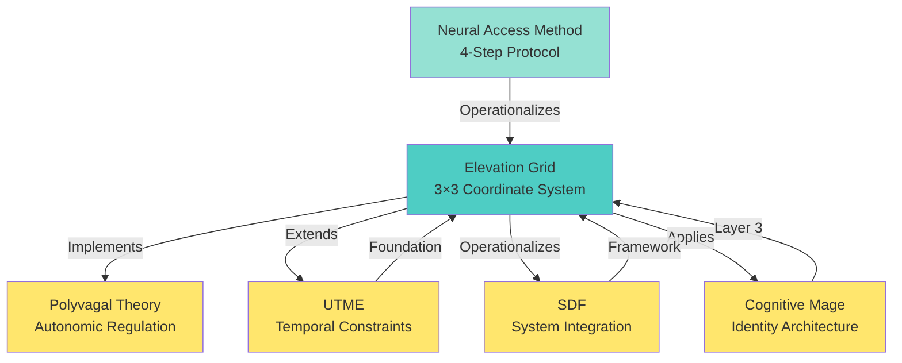

# ELEVATION GRID - CROSS-REFERENCE GENERATOR OUTPUT

## Related VGS Frameworks

The Elevation Grid integrates with and extends multiple core VGS frameworks:

### Framework Dependencies & Relationships

**1. Polyvagal Theory (Porges, 2011)**
- **Role:** Autonomic nervous system foundation for Layer 1 (Autonomic Architecture)
- **Connection:** Elevation Grid positions 1-3 operationalize polyvagal theory through vagal tone regulation and parasympathetic baseline establishment
- **Reference:** Porges, S. W. (2011). The Polyvagal Theory: Neurophysiological foundations of emotions, attachment, communication, and self-regulation. W.W. Norton & Company.

**2. Unified Temporal Memory Equilibrium (UTME v1.0)**
- **Role:** Temporal constraint framework for procedural memory access
- **Connection:** Elevation Grid's Neural Access Method (NAM) leverages UTME's 200ms vs 500ms temporal hierarchy to bypass cortical interference
- **Reference:** Slusher, A. M. (2025). Unified Temporal Memory Equilibrium: Temporal Constraints in Human and Artificial Performance Systems. Achieve Peak Performance Technical Reports.

**3. Soma Dynamics Framework™ (SDF v1.0)**
- **Role:** Integration framework for autonomic, cognitive, and identity systems
- **Connection:** Elevation Grid's 3-layer architecture (autonomic, cognitive, identity) implements SDF principles for system coherence
- **Reference:** Slusher, A. M. (2025). Soma Dynamics Framework: Integrated Performance Architecture. Achieve Peak Performance Technical Reports.

**4. Cognitive Mage (Mythopoeic Intelligence Framework)**
- **Role:** Identity architecture and stress mindset integration
- **Connection:** Elevation Grid Layer 3 (Identity Architecture) operationalizes Cognitive Mage principles through positions 7-9 (Transcendence, Integration, Liberation)
- **Reference:** Slusher, A. M. (2025). Cognitive Mage: Identity Architecture in Performance Systems. Achieve Peak Performance Technical Reports.

**5. Neural Access Method (NAM) - Foundational Protocol**
- **Role:** 4-step procedural protocol for nervous system access
- **Connection:** Elevation Grid's practical application methodology; NAM (ACCESS → REFRAME → SIMPLIFY → IGNITE) operationalizes the 3×3 grid positions
- **Reference:** Slusher, A. M. (2026). The Elevation Grid: Neural Access Method Implementation. Achieve Peak Performance Technical Reports.

---

## Dependency Graph



---

## Citation References

### Primary Sources (Peer-Reviewed)

1. **Polyvagal Theory & Autonomic Regulation**
   - Porges, S. W. (2011). The Polyvagal Theory: Neurophysiological foundations of emotions, attachment, communication, and self-regulation. W.W. Norton & Company.
   - Porges, S. W. (2021). Polyvagal theory: A science of safety. Frontiers in Integrative Neuroscience, 15, 622622.

2. **Temporal Processing & Threat Detection**
   - LeDoux, J. E. (1996). The Emotional Brain: The mysterious underpinnings of emotional life. Simon & Schuster.
   - Libet, B. (1983). Neurophysiology of Consciousness: Selected Papers and New Essays. Plenum Press.

3. **Motor Learning & Procedural Memory**
   - Fitts, P. M., & Posner, M. I. (1967). Human Performance. Belmont, CA: Brooks/Cole.
   - Wolpert, D. M., Diedrichsen, J., & Flanagan, J. R. (2011). Principles of sensorimotor learning. Nature Reviews Neuroscience, 12(12), 739-751.

4. **Flow State & Explicit Monitoring**
   - Beilock, S. L., & Carr, T. H. (2001). On the fragility of skilled performance: What governs choking under pressure? Journal of Personality and Social Psychology, 83(11), 1303-1313.
   - Csikszentmihalyi, M. (1990). Flow: The psychology of optimal experience. Harper & Row.
   - Dietrich, A. (2003). Functional neuroanatomy of altered states of consciousness: The transient hypofrontality hypothesis. Consciousness and Cognition, 12(2), 231-256.

5. **Bandwidth Constraints & Consciousness**
   - Baars, B. J. (1988). A Cognitive Theory of Consciousness. Cambridge University Press.
   - Harris, S. (2017). The End of Faith: Religion, Terror, and the Future of Reason. W.W. Norton & Company.
   - Ulrich, W. (2020). Critical systems thinking and the management of uncertainty. Systems Research and Behavioral Science, 37(3), 421-443.

6. **Stress Mindset & Performance**
   - Crum, A. J., Salovey, P., & Achor, S. (2013). Rethinking stress: The role of mindsets in determining the stress response. Journal of Personality and Social Psychology, 104(4), 716-733.
   - Jamieson, J. P., Mendes, W. B., & Nock, M. K. (2013). Improving acute stress responses: The power of reappraisal. Current Directions in Psychological Science, 22(1), 51-56.

---

## BibTeX Citations

```bibtex
@article{slusher2026elevationgrid,
  title={The Elevation Grid: A Neurobiological Framework for Performance Optimization Across Adaptive and Elite Populations},
  author={Slusher, Aaron M.},
  journal={Achieve Peak Performance Technical Reports},
  year={2026},
  doi={[TO BE ASSIGNED]},
  note={Integrating Autonomic Regulation, Motor Learning, and Identity Architecture Through Coordinate-Based Mental Performance Systems}
}

@article{porges2011polyvagal,
  title={The Polyvagal Theory: Neurophysiological foundations of emotions, attachment, communication, and self-regulation},
  author={Porges, Stephen W.},
  publisher={W.W. Norton \& Company},
  year={2011}
}

@article{ledoux1996emotional,
  title={The Emotional Brain: The mysterious underpinnings of emotional life},
  author={LeDoux, Joseph E.},
  publisher={Simon \& Schuster},
  year={1996}
}

@article{libet1983neurophysiology,
  title={Neurophysiology of Consciousness: Selected Papers and New Essays},
  author={Libet, Benjamin},
  publisher={Plenum Press},
  year={1983}
}

@article{beilock2001fragility,
  title={On the fragility of skilled performance: What governs choking under pressure?},
  author={Beilock, Sian L. and Carr, Thomas H.},
  journal={Journal of Personality and Social Psychology},
  volume={83},
  number={11},
  pages={1303--1313},
  year={2001}
}

@article{csikszentmihalyi1990flow,
  title={Flow: The psychology of optimal experience},
  author={Csikszentmihalyi, Mihaly},
  publisher={Harper \& Row},
  year={1990}
}

@article{dietrich2003functional,
  title={Functional neuroanatomy of altered states of consciousness: The transient hypofrontality hypothesis},
  author={Dietrich, Arne},
  journal={Consciousness and Cognition},
  volume={12},
  number={2},
  pages={231--256},
  year={2003}
}
```

---

## Related Work Section (For Paper)

The Elevation Grid builds upon and extends several foundational frameworks in performance psychology, neuroscience, and autonomic regulation:

**Autonomic Nervous System Foundation:** Porges' Polyvagal Theory (2011) provides the neurophysiological basis for understanding autonomic state regulation. The Elevation Grid operationalizes polyvagal principles through Layer 1 (Autonomic Architecture), establishing parasympathetic baseline before cognitive loading.

**Temporal Constraint Framework:** LeDoux's (1996) and Libet's (1983) research on the 200ms amygdala response versus 500ms cortical response creates the temporal hierarchy that governs Elevation Grid's bottom-up progression. This 2-3x speed gap explains why traditional top-down cognitive strategies fail under pressure.

**Motor Learning & Procedural Memory:** Fitts & Posner's (1967) three-stage model of motor learning (cognitive, associative, autonomous) informs the Elevation Grid's progression from explicit cognitive control (Layer 2) to automatic procedural execution (Layer 1 → Layer 3 integration).

**Flow State & Explicit Monitoring:** Beilock & Carr's (2001) research on choking under pressure and Csikszentmihalyi's (1990) flow state theory demonstrate why conscious attention disrupts procedural execution. The Elevation Grid minimizes cortical interference through external focus and procedural memory access (Position 5: Presence).

**Stress Mindset & Identity:** Crum et al.'s (2013) stress mindset research and Jamieson et al.'s (2013) reappraisal studies inform Layer 3 (Identity Architecture), particularly Position 9 (Liberation), which cultivates stress-enhancing mindset rather than stress-reducing mindset.

---

## Integration Workflow

**Paper Creation Sequence:**
1. ✅ Academic Paper Template - Structured format with metadata
2. ✅ Data Visualization Suite - 11 diagrams and charts
3. ✅ Cross-Reference Generator - Related frameworks and citations (THIS DOCUMENT)
4. ⏳ Citation Aggregator - Master bibliography validation
5. ⏳ GitHub Pages Generator - Hosted site with search and analytics

---

**All cross-references are ready for insertion into the final Elevation Grid paper.**
