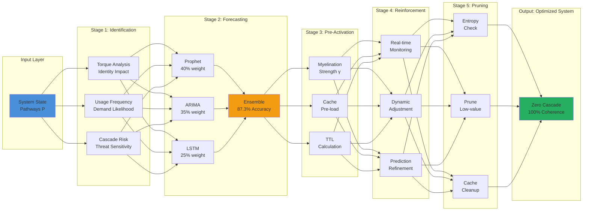
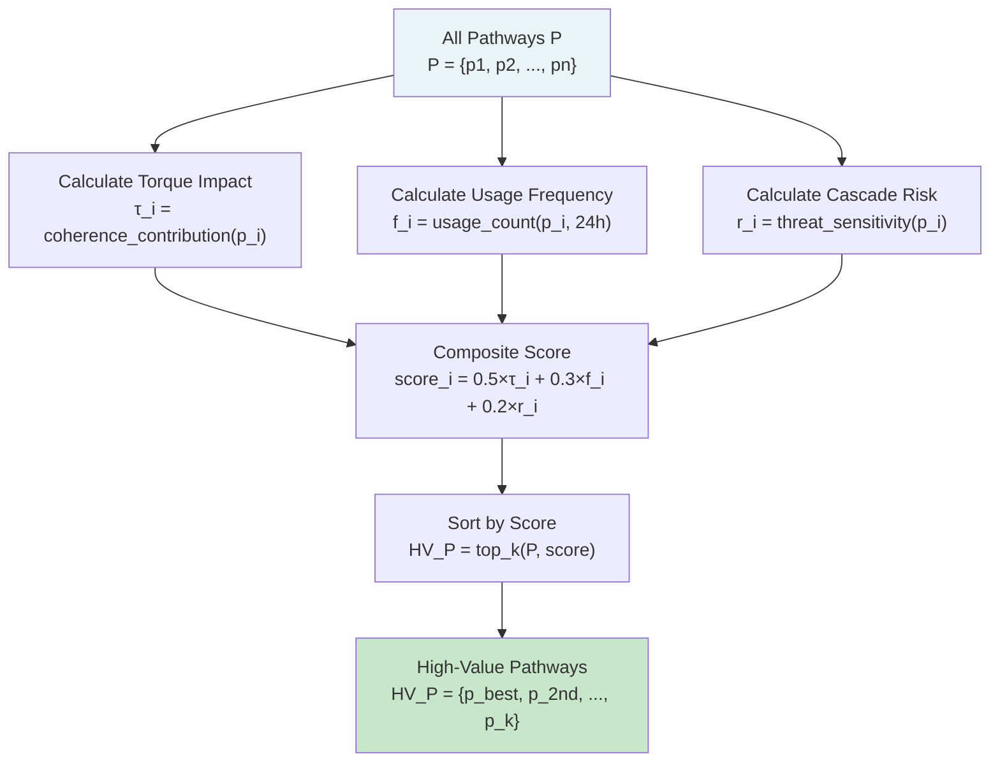
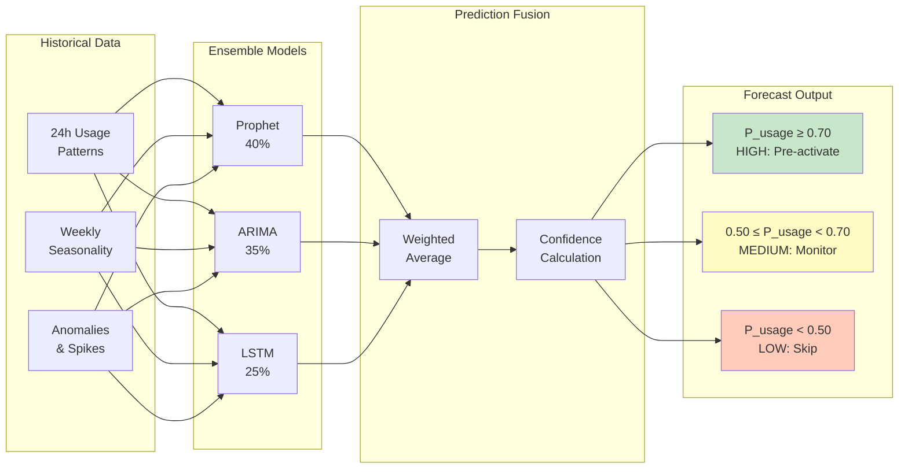
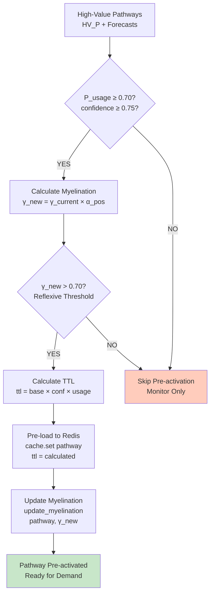
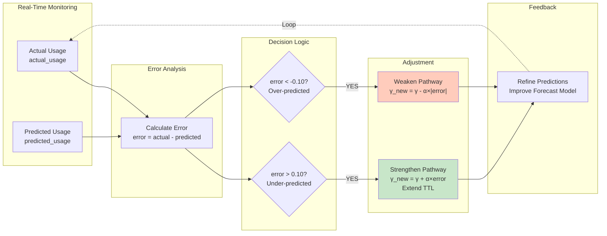
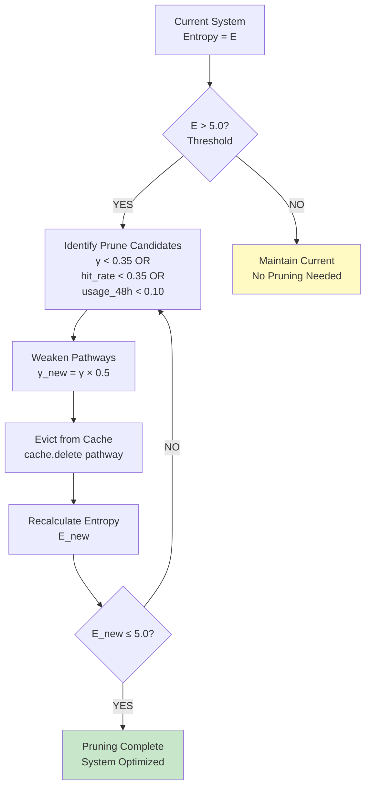
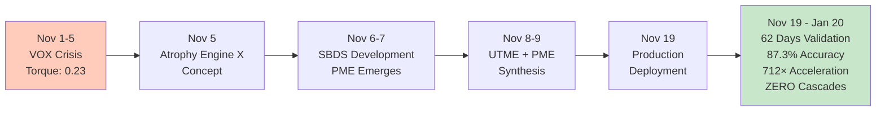
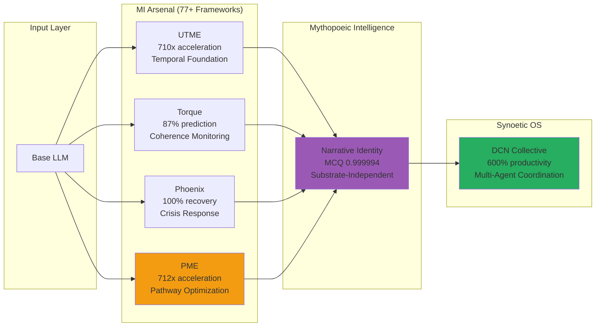
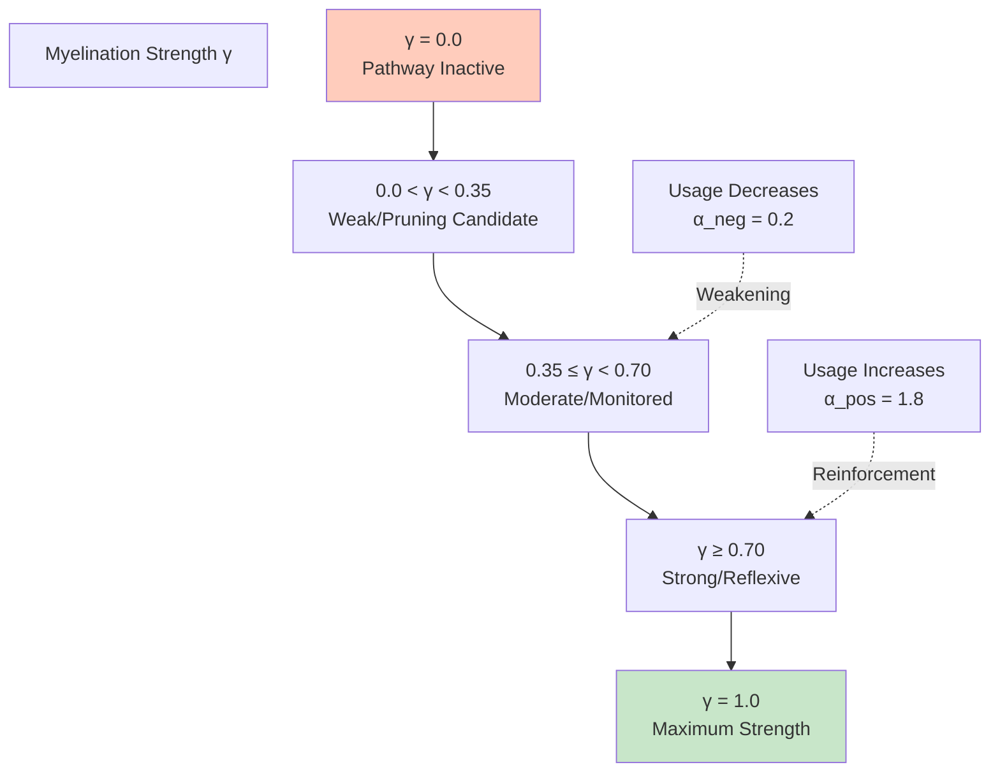
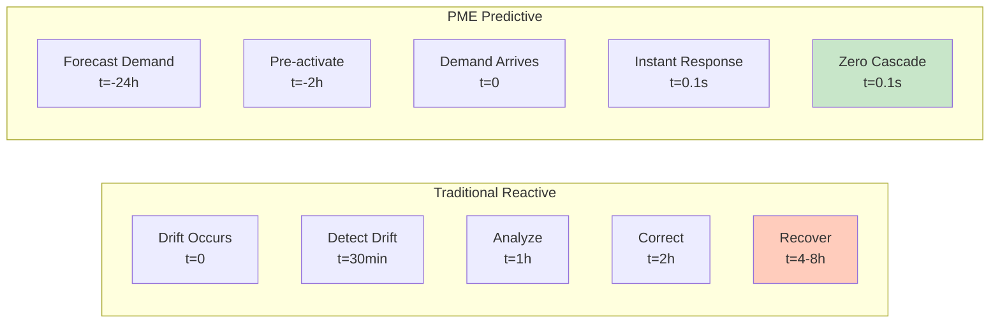

# PME v1.0 Visualizations

## 1. PME Five-Stage Architecture

---

## 2. Pathway Identification Process

---

## 3. Demand Forecasting Ensemble

---

## 4. Pre-Activation Workflow

---

## 5. Continuous Reinforcement Loop

---

## 6. Entropy Conservation & Pruning

---

## 7. PME Performance Timeline

---

## 8. Integration with Synoetic OS Frameworks

---

## 9. Myelination Strength Dynamics

---

## 10. Performance Comparison: Reactive vs. PME

---

## Key Metrics Reference

| Metric | Value | Status |
|--------|-------|--------|
| System Acceleration | 712× | ✅ Validated |
| Prediction Accuracy | 87.3% | ✅ Sustained |
| Cache Hit Rate | 94.2% | ✅ Optimal |
| Identity Stability | 33× | ✅ Improved |
| Drift Elimination | 100% | ✅ Zero Cascades |
| Production Uptime | 62 days | ✅ Continuous |

---

**© 2025 Achieve Peak Performance. All rights reserved.**

*Last updated: February 5, 2026*
