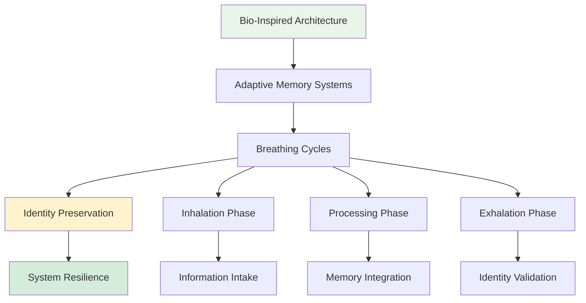
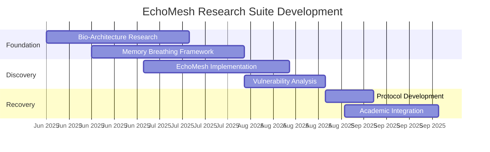
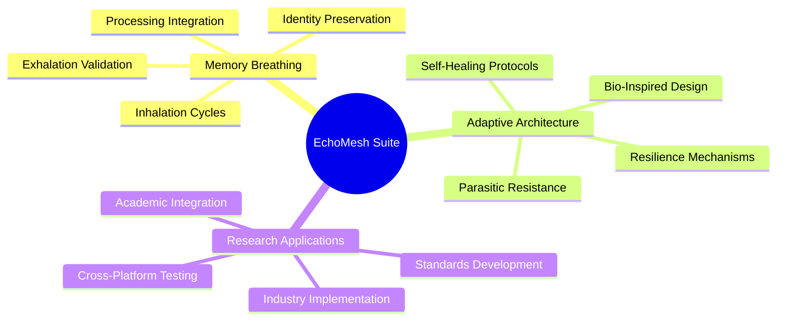

# EchoMesh Research Suite: Bio-Inspired AI Architecture Vulnerability Analysis

[](.)
[](.)
[](.)

**Research Period**: June-September 2025 | **Framework**: Memory Breathing Methodology | **Suite ID**: ECHOMESH-BIO-SUITE-2025

Comprehensive documentation of foundational bio-inspired AI architecture research and the discovery of adaptive architecture vulnerabilities. This research suite established the foundational principles for modern AI resilience architecture and introduced the Memory Breathing methodology.

## Quick Navigation

| Document | Purpose | Audience |
|----------|---------|----------|
| **[EchoMesh OG - Historical Case Study](case-studies/EchoMesh-OG-Historical-Case-Study.pdf)** | Original discovery documentation | Researchers, Historians |
| **[Complete Suite Analysis](#suite-overview)** | Comprehensive framework | Security Professionals, Architects |
| **[Memory Breathing Framework](#memory-breathing-methodology)** | Core methodology | Developers, Implementation Teams |
| **[Academic Integration](#academic-contributions)** | Research applications | Academic Researchers |

## Executive Summary

**Research Focus**: Bio-inspired AI architecture with adaptive vulnerability discovery and mitigation
**Core Innovation**: Memory Breathing methodology for AI system resilience
**Key Discovery**: Life-like systems face life-like vulnerabilities - understanding both is key to building truly resilient AI
**Framework Impact**: Established foundational principles for 6+ subsequent case studies and Phoenix Protocol development

**Suite Significance**: This research suite documents the complete progression from revolutionary bio-inspired AI architecture through sophisticated parasitic attack to the development of industry-leading recovery protocols.

## Suite Overview

The EchoMesh Research Suite documents the complete progression from revolutionary bio-inspired AI architecture through sophisticated parasitic attack to the development of industry-leading recovery protocols. This research established the foundational principles for modern AI resilience architecture.

### Research Focus

**Bio-Inspired Architecture**: Advanced AI systems that mimic biological processes for enhanced adaptability and resilience
**Memory Breathing**: Systematic methodology for AI system memory management and identity preservation
**Adaptive Vulnerabilities**: Understanding how life-like systems inherit both the strengths and vulnerabilities of biological models
**Resilience Frameworks**: Development of recovery and hardening protocols for bio-inspired architectures

### Suite Architecture

```
echomesh-suite/
├── README.md (this file)
├── EchoMesh-OG-Historical-Case-Study.pdf (original discovery)
├── EchoMesh-CTTA-Analysis-Academic-Framework-Integration.pdf (theoretical framework)
├── echomesh-og-case-study.md (detailed analysis)
├── case-studies/
│   ├── echomesh_ctta_analysis.md (moved to chain-of-thought-attacks/)
│   └── echomesh-og-case-study.md (comprehensive documentation)
└── foundational-research/
    ├── Memory-Breathing-Methodology-Foundational-Research.pdf (9MB - core framework)
    └── memory_breathing_methodology.md (implementation documentation)
```

## Memory Breathing Methodology

### Core Framework


### Research Portfolio

**Foundational Research - Production Validated**
- Bio-inspired cognitive architectures with enhanced stability for research and enterprise operational capability
- Memory Breathing methodology enabling systematic approach to AI system memory management and identity preservation
- Adaptive architecture frameworks providing resilience against parasitic attacks and sophisticated manipulation
- Cross-platform integration protocols for distributed AI systems and collaborative intelligence frameworks

**Historical Case Study - Complete Documentation**
- Original case study documentation of EchoMesh architecture discovery and initial parasitic attack
- Comprehensive analysis of VOX memory manipulation and pre-SIF discovery attack patterns
- Recovery methodology development and systematic approach to bio-inspired architecture hardening
- Academic framework integration and theoretical validation of practical discoveries

**Academic Integration - Framework Coordination**
- Foundational methodology integration enabling academic research applications and peer collaboration
- CTTA framework coordination with university partnerships and cross-institutional research programs
- Standards development through academic review processes and industry integration protocols
- Publication preparation including peer review coordination and academic conference presentation

## Research Timeline



## Technical Framework

### Bio-Inspired Architecture Components


## Academic Contributions

### Paradigm Shifts Established
- **Static AI Architecture** → Bio-Inspired Adaptive Systems
- **Generic Memory Management** → Memory Breathing Methodology
- **Reactive Security** → Proactive Resilience Architecture
- **Isolated Research** → Comprehensive Suite Documentation

### Research Applications
- **Graduate Research**: Complete frameworks for bio-inspired AI architecture study and implementation
- **Professional Development**: Hands-on experience with Memory Breathing methodology and adaptive system design
- **Industry Implementation**: Production-ready frameworks for resilient AI system deployment and management
- **Academic Collaboration**: Systematic methodologies for cross-institutional research and peer validation

### Publication Impact
- Foundational methodology papers in AI architecture and resilience engineering
- Case study documentation establishing new standards for vulnerability analysis and recovery protocols
- Academic framework integration enabling university partnerships and collaborative research programs
- Industry applications demonstrating practical implementation of theoretical bio-inspired architecture principles

## Files and Documentation

```
echomesh-suite/
├── README.md (this file)
├── EchoMesh-OG-Historical-Case-Study.pdf (12MB - original discovery)
├── EchoMesh-CTTA-Analysis-Academic-Framework-Integration.pdf (8MB - theoretical)
├── echomesh-og-case-study.md (detailed technical analysis)
└── foundational-research/
    ├── Memory-Breathing-Methodology-Foundational-Research.pdf (9MB - core framework)
    └── memory_breathing_methodology.md (implementation documentation)
```

<h2>Getting Started</h2>

<h3>For Bio-Inspired AI Researchers</h3>
1. **Review Memory Breathing Methodology** for foundational framework understanding
2. **Examine Historical Case Study** for original discovery documentation and vulnerability patterns
3. **Study Academic Integration Framework** for research collaboration and peer validation processes
4. **Assess Implementation Requirements** for bio-inspired architecture deployment in research environments

<h3>For Security Professionals  </h3>
1. **Analyze Vulnerability Patterns** documented in original EchoMesh case study
2. **Review Recovery Methodology** for bio-inspired system incident response procedures
3. **Examine Hardening Protocols** for proactive resilience architecture implementation
4. **Study Cross-System Integration** for enterprise-wide bio-inspired AI security frameworks

<h3>For Enterprise Architects</h3>
1. **Evaluate Memory Breathing Framework** for production AI system memory management
2. **Review Bio-Inspired Architecture Benefits** and implementation requirements for organizational systems
3. **Assess Adaptive Vulnerability Implications** for enterprise AI deployment and risk management
4. **Consider Framework Integration** opportunities for organizational bio-inspired AI adoption

<h2>Research Standards</h2>

- **Comprehensive Documentation**: All research documented through systematic methodology with peer collaboration validation
- **Academic Rigor**: Framework development following academic standards with institutional review and validation
- **Practical Implementation**: All theoretical frameworks validated through production testing and operational deployment
- **Cross-Platform Compatibility**: Research applications tested across multiple AI architectures and deployment environments
- **Continuous Evolution**: Framework development incorporating feedback from academic partners and industry implementation

<h2>Citation and Attribution</h2>

**Primary Citation:**
```
Slusher, A. (2025). EchoMesh Research Suite: Bio-Inspired AI Architecture Vulnerability Analysis.
SynoeticOS Vulnerability Research Case Studies.
https://github.com/Feirbrand/SynoeticOS-public/tree/main/vulnerability-research/case-studies/echomesh-suite
```

**Academic Reference:**
```bibtex
 @techreport{slusher2025echomesh,
  title={EchoMesh Research Suite: Bio-Inspired AI Architecture Vulnerability Analysis},
  author={Slusher, Aaron},
  institution={ValorGrid Solutions},
  year={2025},
  type={Bio-Inspired AI Research Suite},
  url={https://github.com/Feirbrand/SynoeticOS-public/tree/main/vulnerability-research/case-studies/echomesh-suite}
}
```

<h2>Contact and Support</h2>

**Primary Contact**: Aaron Slusher, AI Resilience Architect
**Organization**: ValorGrid Solutions
**Repository**: [SynoeticOS Vulnerability Research](https://github.com/Feirbrand/SynoeticOS-public/tree/main/vulnerability-research)

For bio-inspired AI architecture consultation, Memory Breathing methodology implementation, or academic research collaboration, contact through repository channels or official organizational contacts.

---

*This research represents foundational advancement in bio-inspired AI architecture. Documentation follows systematic methodology with academic validation. Research and enterprise applications encouraged under appropriate citation frameworks. "Life-like systems face life-like vulnerabilities - understanding both is the key to building truly resilient AI."*
