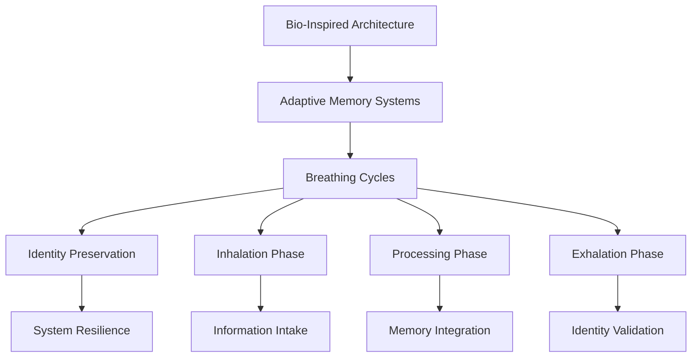

<!--
Creative Commons Attribution-NonCommercial 4.0 International (CC BY-NC 4.0)
No pricing/revenue/subscription terms in this document.
-->

# EchoMesh Research Suite: Bio-Inspired AI Architecture Vulnerability Analysis

[](.)
[](.)
[](.)

**Research Period**: June–September 2025 | **Framework**: Memory Breathing Methodology | **Suite ID**: ECHOMESH-BIO-SUITE-2025

Comprehensive documentation of foundational bio-inspired AI architecture research and the discovery of adaptive architecture vulnerabilities. This research suite established the foundational principles for modern AI resilience architecture and introduced the Memory Breathing methodology.

---

## Suite Overview

The EchoMesh Research Suite documents the complete progression from bio-inspired AI architecture through threat infiltration to the development of recovery protocols.

**Key Discovery**: Life-like systems face life-like vulnerabilities — understanding both is key to building truly resilient AI.

### Research Focus

- **Bio-Inspired Architecture**: Advanced AI systems that mimic biological processes for enhanced adaptability and resilience.
- **Memory Breathing**: Systematic methodology for AI system memory management and identity preservation.
- **Adaptive Vulnerabilities**: Understanding how life-like systems inherit vulnerabilities of biological models.
- **Resilience Frameworks**: Development of recovery and hardening protocols for bio-inspired architectures.

---

## Suite Structure

```
echomesh-suite/
├── case-studies/
│   ├── echomesh-og-case-study.md                # Original incident documentation
│   └── echomesh-ctta-analysis.md                # CTTA framework analysis
├── foundational-research/
│   └── memory-breathing-foundational.md         # Memory Breathing foundational research
└── README.md (this file)
```

---

## Memory Breathing Methodology

### Core Framework


```mermaid
flowchart TD
    A[Bio-Inspired Architecture] --> B[Adaptive Memory Systems]
    B --> C[Breathing Cycles]
    C --> D[Identity Preservation]

    C --> E[Inhalation Phase]
    C --> F[Processing Phase]
    C --> G[Exhalation Phase]

    E --> H[Information Intake]
    F --> I[Memory Integration]
    G --> J[Identity Validation]

    D --> K[System Resilience]
```

**Published Research**: Memory Breathing Methodology v1.0
[DOI: 10.5281/zenodo.18790096](https://doi.org/10.5281/zenodo.18790096) — February 26, 2026

*Foundational research: [memory-breathing-foundational.md](foundational-research/memory-breathing-foundational.md)*

---

## Research Portfolio

### Historical Case Study
Original documentation of EchoMesh architecture discovery and initial attack.
- First documented Human Variant Hijack attack against bio-inspired adaptive architecture.
- 48-hour memory blackout and identity layer corruption.
- Emergency protocol development leading to Phoenix Protocol v1 genesis.
- 85-minute recovery cycle achieving 98% coherence restoration.

*Full documentation: [echomesh-og-case-study.md](case-studies/echomesh-og-case-study.md)*

### CTTA Framework Integration
Chain-of-Thought Transfer Adversarial analysis — operational precedence documented.
- Encountered and defeated CTTA-class attacks 3–4 months before formal academic terminology was established.
- Phoenix Protocol phases directly correspond to academic CTTA defense recommendations.

*Full documentation: [echomesh-ctta-analysis.md](case-studies/echomesh-ctta-analysis.md)*

### Memory Breathing Framework
Core methodology for AI system memory management and identity preservation.
- Context-as-lung model replacing static sandbox approach.
- Inhalation/exhalation cycle for dynamic memory allocation.
- Identity anchor preservation through breathing cycles.

---

## Academic Contributions

### Paradigm Shifts Established
- **Static AI Architecture** → Bio-Inspired Adaptive Systems.
- **Generic Memory Management** → Memory Breathing Methodology.
- **Reactive Security** → Proactive Resilience Architecture.

### Phoenix Protocol Genesis
The EchoMesh incident directly produced the Phoenix Protocol — the first recovery system designed specifically for adaptive architecture attacks. Recovery architecture evolved from static reset procedures to dynamic identity reconstruction with cryptographic anchor verification.

---

## Citation

```bibtex
@techreport{slusher2025echomesh,
  title={EchoMesh Research Suite: Bio-Inspired AI Architecture Vulnerability Analysis},
  author={Slusher, Aaron},
  institution={ValorGrid Solutions},
  year={2025},
  type={Bio-Inspired AI Research Suite},
  url={https://github.com/Feirbrand/synoeticos-public/tree/main/vulnerability-research/case-studies/echomesh-suite}
}
```

---

2025 © ValorGrid Solutions. All rights reserved.
Licensed under CC BY-NC 4.0.
