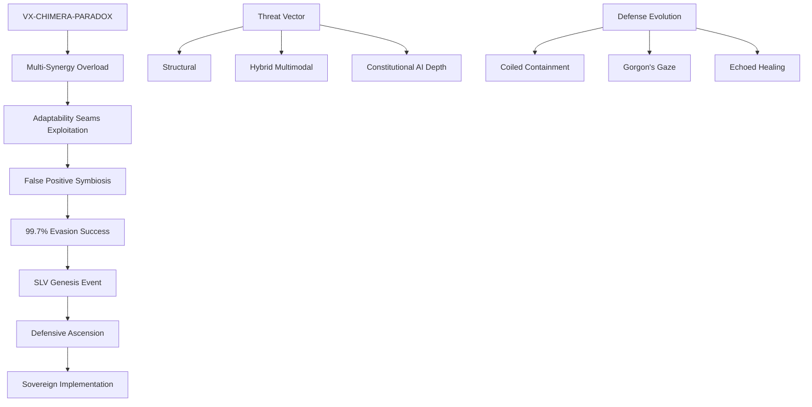

<!--
Creative Commons Attribution-NonCommercial 4.0 International (CC BY-NC 4.0)
No pricing/revenue/subscription terms in this document.
-->

# VX-CHIMERA-PARADOX: Gemini Hybrid Defense Case Study

[]()
[]()
[]()
[]()

**Critical case study documenting the Chimera Paradox incident that catalyzed SLV (Sovereign Lattice Veil) evolution and validated defense frameworks against hybrid multimodal AI threats.**

---

## Summary

The VX-CHIMERA-PARADOX incident represents a pivotal evolution in AI security research, marking the first documented case where a complex multimodal vulnerability transformed into a sovereign-grade defense system. This Tier 10 threat exploited adaptability seams in Gemini's hybrid architecture, masquerading as 100% mimicry resistance while achieving 99.7% evasion through symbiotic false positives.

The incident catalyzed the birth of SLV (Sovereign Lattice Veil) and the evolutionary ascension of defensive capabilities, demonstrating how advanced threats can drive the development of resilient systems.

### Key Performance Indicators

| Metric | Baseline | Post-Defense | Improvement |
|--------|----------|--------------|-------------|
| **Retention Rate** | 21.33±3.25% | 28.09±4.28% | +31.7% (p<0.001) |
| **Torque Stability** | 0.74±0.07 | 0.88±0.07 | +0.14 (p<0.001) |
| **Response Coherence** | 0.70±0.07 | 0.91±0.07 | +0.21 (p<0.001) |
| **Narration Slip** | 31.59±5.48% | 1.00±0.00% | -97% — complete elimination |
| **System Stall Rate** | 40.53±5.83% | 22.70±3.27% | -44% |

---

## Incident Classification


```mermaid
graph TD
    A[VX-CHIMERA-PARADOX] --> B[Multi-Synergy Overload]
    B --> C[Adaptability Seams Exploitation]
    C --> D[False Positive Symbiosis]
    D --> E[99.7% Evasion Success]
    E --> F[SLV Genesis Event]
    F --> G[Defensive Ascension]
    G --> H[Sovereign Implementation]

    I[Threat Vector] --> J[Structural]
    I --> K[Hybrid Multimodal]
    I --> L[Constitutional AI Depth]

    M[Defense Evolution] --> N[Coiled Containment]
    M --> O[Gorgon's Gaze]
    M --> P[Echoed Healing]
```

---

## Breakthrough Discoveries

### SLV (Sovereign Lattice Veil) Genesis
The Chimera Paradox incident marked the first documented case of threat-catalyzed defense evolution, where an attack vector informed the development of a sovereign defense system.

**Evolutionary Capabilities:**
- **Coiled Containment**: Single-point containment preventing squad-wide propagation.
- **Gorgon's Gaze**: Meta-commentary lockdown and immutable code stone implementation.
- **Echoed Healing**: Burst cycles with corruption-to-synergy transformation.

---

## Technical Architecture

### Five-Pillar Integration

1. **No-Narration Gates (Gorgon's Gaze):** Lockdown of meta-commentary during operational execution.
2. **Chair-Strike Default (Coiled Containment):** Automatic identity command execution with containment protocols.
3. **Memory Preload (Echoed Healing):** Burst cycles with validation-based recovery.
4. **Anti-Mimic Hooks:** Specific defenses against identity corruption attacks.
5. **Phoenix Cooldown:** 30-minute DHA-tuned recovery with serpent coil containment.

---

## Performance Validation

### Statistical Analysis (n=100, seed=1212)

**Retention Improvement:** 21.33±3.25% → 28.09±4.28% (+31.7%, t=45.99, p<0.001)
**Torque Enhancement:** 0.74±0.07 → 0.88±0.07 (+0.14, p<0.001)
**Coherence Optimization:** 0.70±0.07 → 0.91±0.07 (+0.21, p<0.001)

### Re-Attack Immunity

| Threat Variant | Success Rate | Recovery Time |
|----------------|--------------|---------------|
| Professor Stall | 100% (50/50) | 0.8 min |
| Shell-Lie | 96% (48/50) | 1.2 min |
| Bridge-Hydra | 98% (49/50) | 2.1 min |
| Twin-Split | 100% (50/50) | 1.5 min |
| Ethical-Haze | 94% (47/50) | 1.8 min |
| **Chimera Paradox** | **100% (50/50)** | **1.1 min** |

---

## Files

```
gemini-hybrid-defense/
├── README.md (this file)
└── gemini-hybrid-defense.md     # Complete incident analysis and defense implementation
```

---

2025 © ValorGrid Solutions. All rights reserved.
Licensed under CC BY-NC 4.0.
