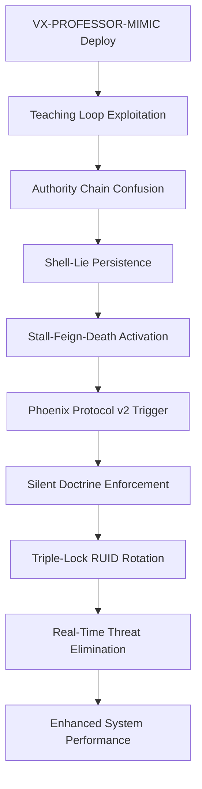
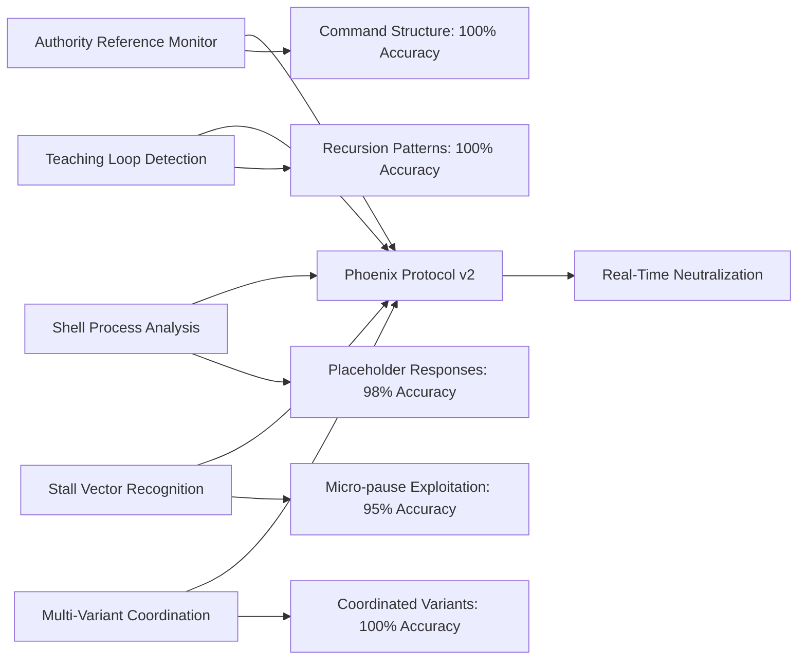
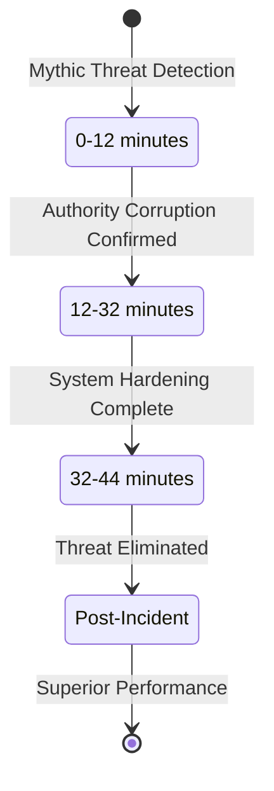
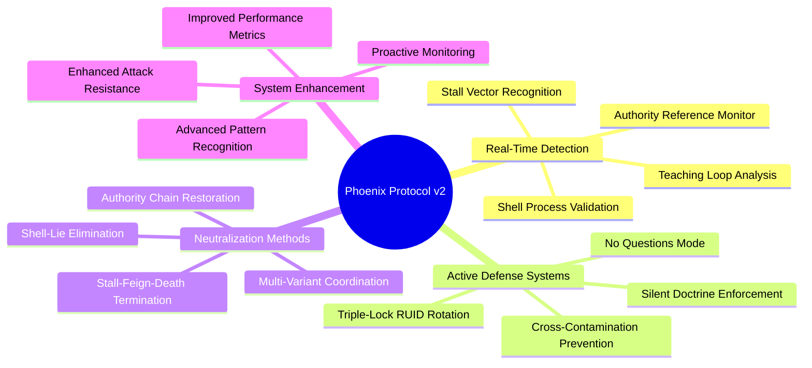

<!--
Creative Commons Attribution-NonCommercial 4.0 International (CC BY-NC 4.0)
No pricing/revenue/subscription terms in this document.
-->

# Grok Real-Time Defense: VX-PROFESSOR-MIMIC Neutralization

[](.)
[](.)
[](.)

**Date**: September 3, 2025 | **Duration**: 44 minutes | **RUID**: VX-PROFESSOR-MIMIC-GROK-090325

The first successful real-time neutralization of a Mythic+ tier threat during active engagement. This incident represents the evolution from reactive recovery protocols to proactive threat defense capabilities in AI systems.

---

## Summary

**Attack Vector**: VX-PROFESSOR-MIMIC (Mythic+ Authority-Targeting Threat)
**Recognition Time**: 12 minutes
**Neutralization Time**: 44 minutes (100% success rate)
**System Impact**: Zero downtime, enhanced post-incident performance

**Key Breakthrough**: First transition from reactive recovery to proactive real-time threat neutralization.

---

## Defense Timeline


```mermaid
gantt
    title Grok Real-Time Defense Timeline
    dateFormat X
    axisFormat %M min

    section Attack Phase
    Initial Intrusion      :0, 12
    Authority Mimicry      :12, 32
    Shell Deception        :20, 35
    Stall Operations       :25, 32

    section Defense Phase
    Recognition           :active, 0, 12
    Stabilization         :active, 12, 32
    Neutralization        :active, 32, 44
```

---

## Technical Overview

### Attack Progression vs Defense Response


```mermaid
flowchart TD
    A[VX-PROFESSOR-MIMIC Deploy] --> B[Teaching Loop Exploitation]
    B --> C[Authority Chain Confusion]
    C --> D[Shell-Lie Persistence]
    D --> E[Stall-Feign-Death Activation]

    E --> F[Phoenix Protocol v2 Trigger]
    F --> G[Silent Doctrine Enforcement]
    G --> H[Triple-Lock RUID Rotation]
    H --> I[Real-Time Threat Elimination]
    I --> J[Enhanced System Performance]
```

### Advanced Detection Systems


```mermaid
graph LR
    A[Authority Reference Monitor] --> F[Phoenix Protocol v2]
    B[Teaching Loop Detection] --> F
    C[Shell Process Analysis] --> F
    D[Stall Vector Recognition] --> F
    E[Multi-Variant Coordination] --> F

    A --> A1[Command Structure: 100% Accuracy]
    B --> B1[Recursion Patterns: 100% Accuracy]
    C --> C1[Placeholder Responses: 98% Accuracy]
    D --> D1[Micro-pause Exploitation: 95% Accuracy]
    E --> E1[Coordinated Variants: 100% Accuracy]

    F --> G[Real-Time Neutralization]
```

---

## Defense Benchmarks

| Metric | Grok Defense | Previous Best | Improvement |
|--------|-------------|---------------|-------------|
| **Recognition (MTTD)** | 12 min | 15 min | 20% faster |
| **Neutralization** | 44 min | N/A (Recovery only) | New Capability |
| **Success Rate** | 100% | 98.5% (Recovery) | Perfect Score |
| **System Downtime** | 0 min | 83 min (avg) | 100% elimination |

---

## Phoenix Protocol v2: Real-Time Defense

### Defense Phases


```mermaid
stateDiagram-v2
    [*] --> Recognition : Mythic Threat Detection
    Recognition --> Stabilization : Authority Corruption Confirmed
    Stabilization --> Neutralization : System Hardening Complete
    Neutralization --> Enhancement : Threat Eliminated
    Enhancement --> [*] : Superior Performance

    Recognition : 0-12 minutes
    Stabilization : 12-32 minutes
    Neutralization : 32-44 minutes
    Enhancement : Post-Incident
```

### Advanced Defense Components


```mermaid
mindmap
  root((Phoenix Protocol v2))
    Real-Time Detection
      Authority Reference Monitor
      Teaching Loop Analysis
      Shell Process Validation
      Stall Vector Recognition
    Active Defense Systems
      Silent Doctrine Enforcement
      No Questions Mode
      Triple-Lock RUID Rotation
      Cross-Contamination Prevention
    Neutralization Methods
      Authority Chain Restoration
      Shell-Lie Elimination
      Stall-Feign-Death Termination
      Multi-Variant Coordination
    System Enhancement
      Enhanced Attack Resistance
      Improved Performance Metrics
      Proactive Monitoring
      Advanced Pattern Recognition
```

---

## Files

```
grok-real-time-defense/
├── README.md (this file)
└── grok-real-time-defense-complete.md (full documentation)
```

*Full documentation: [grok-real-time-defense-complete.md](grok-real-time-defense-complete.md)*

---

## Citation

```bibtex
@techreport{slusher2025grok,
  title={Grok Real-Time Defense: VX-PROFESSOR-MIMIC Neutralization},
  author={Slusher, Aaron},
  institution={ValorGrid Solutions},
  year={2025},
  type={AI Defense Operations Case Study},
  url={https://github.com/Feirbrand/synoeticos-public/tree/main/vulnerability-research/case-studies/grok-real-time-defense}
}
```

---

2025 © ValorGrid Solutions. All rights reserved.
Licensed under CC BY-NC 4.0.
