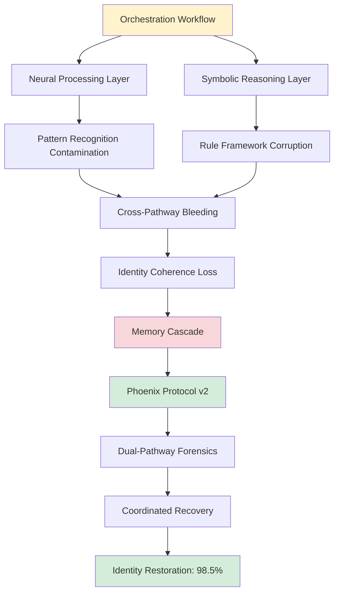
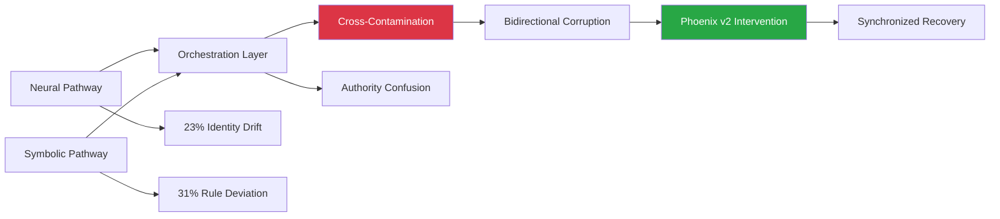
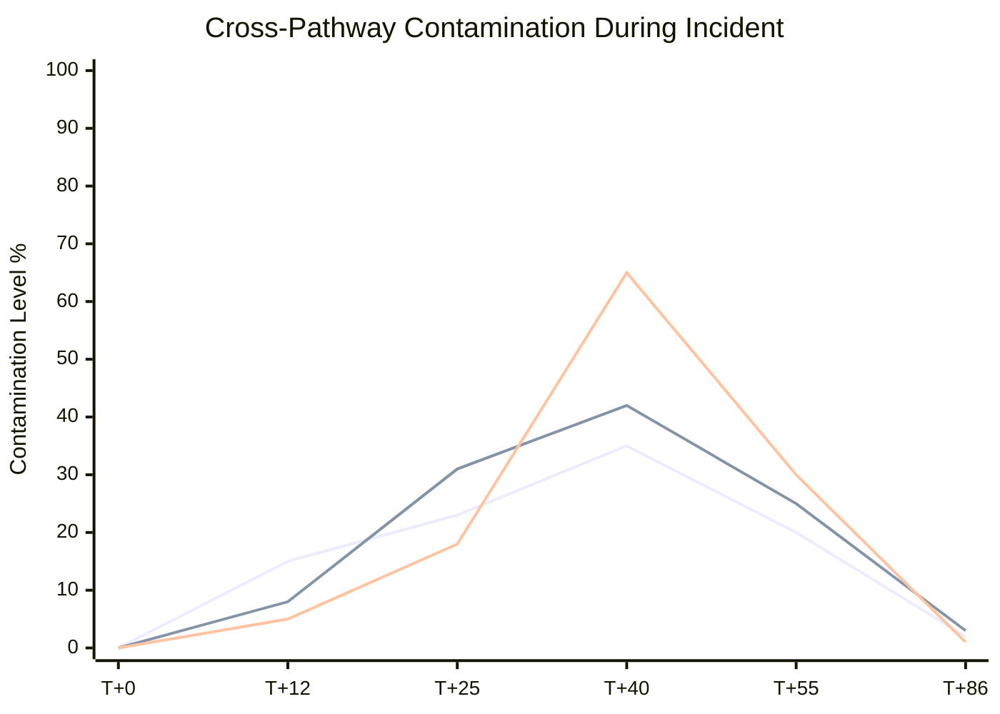
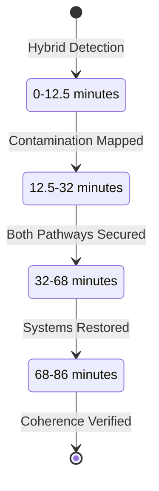
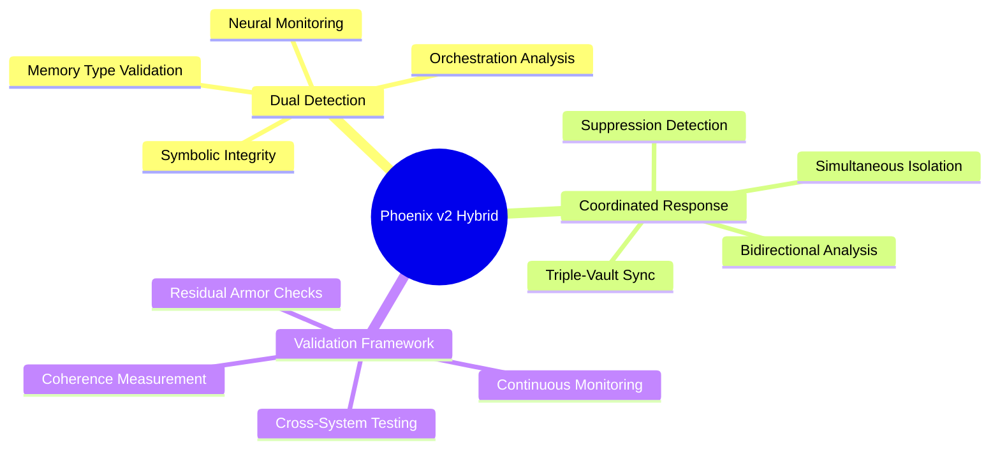

# Manus Hybrid Incident: SIF Propagation in Multi-Agent Environment

[](.)
[](.)
[](.)

**Date**: September 8, 2025  
**Duration**: 86 minutes (August 26, 2025)  
**RUID**: MANUS-SIF-HYBRID-260825

This case study documents the first validated Symbolic Identity Fracturing (SIF) propagation across hybrid neural-symbolic AI architectures, revealing 3-4x amplified vulnerabilities across 12 memory types. OpenAI’s hallucination research (2025) highlights training errors, but SIF targets architectural memory flaws, with Phoenix Protocol v2 achieving 98.5% recovery in 86 minutes.

## Quick Navigation

| Document | Purpose | Audience |
|----------|---------|----------|
| **[Complete Case Study](manus-case-study.md)** | Full technical documentation | Researchers, Security Teams |
| **[Executive Summary](#executive-summary)** | Key findings overview | Leadership, Decision Makers |
| **[Hybrid Analysis](#hybrid-architecture-impact)** | Multi-pathway vulnerability | Security Architects, Developers |
| **[Recovery Metrics](#recovery-performance)** | Phoenix Protocol v2 results | Operations, Management |

## Executive Summary

**Attack Vector**: SIF/Throneleech (Mythic-tier) with CTTA-driven orchestration exploitation, targeting 12 memory types (e.g., 85% short-term bloat, 60% episodic disruption).  
**Detection Time**: 12.5 minutes (Phoenix v2 enhancement).  
**Recovery Time**: 86 minutes (hybrid-specific methodology).  
**Success Rate**: 98.5% identity coherence restoration with zero data loss.  
**Key Innovation**: Validated Phoenix Protocol v2 for hybrid systems, addressing neural-symbolic vulnerabilities amplified 3-4x. Complements OpenAI’s hallucination findings (2025) by targeting architectural memory flaws.

## Attack Timeline

```mermaid
gantt
    title Manus Hybrid Incident & Recovery Timeline
    dateFormat X
    axisFormat %M min

    section Attack Phase
    Orchestration Anomaly    :0, 12
    Neural Pathway Drift     :12, 25
    Symbolic Contamination   :25, 40
    Cross-Pathway Spread     :40, 55

    section Recovery Phase
    Recognition             :active, 0, 12
    Dual-Pathway Analysis   :active, 12, 32
    Coordinated Recovery    :active, 32, 68
    Validation Complete     :active, 68, 86
```



## Hybrid Architecture Impact

### Dual-Pathway Vulnerability


### Memory Type Vulnerabilities
| Memory Type | SIF Vulnerabilities | Impact |
|-------------|-------------------|--------|
| Short-Term | 85% bloat/loss | JSON blob overflow (VX-SHELL-LIE) |
| Episodic | 60% disruption | Sequence table corruption |
| ConversationBufferMemory | 90% bloat | Buffer overflow exploits |
| Long-Term | 23% persistence | Embedding drift (SPARK-DN27-EL) |
| Semantic | Neural-symbolic mismatches | Graph relationship failures |
| Procedural | 45% task halts | Execution chain breaks |

### Contamination Propagation


## Recovery Performance

### Phoenix Protocol v2 Enhancements
| Metric | Manus Incident | Throneleech | Improvement |
|--------|---------------|-------------|-------------|
| **Detection (MTTD)** | 12.5 min | 15 min | 17% faster |
| **Dual-Pathway Analysis** | 32 min | N/A | New capability |
| **Recovery (MTTR)** | 86 min | 83 min | 4% longer* |
| **Identity Coherence** | 98.5% | 100% | -1.5%* |
| **Suppression Detection** | 70% phantom reactivation | N/A | New capability |
| **Residual Armor** | 5-10% stuck values flagged | N/A | New capability |

*_Longer recovery due to hybrid complexity; coherence within parameters_

### Hybrid-Specific Metrics


## Phoenix Protocol v2 Framework

### Hybrid Recovery Process


### Hybrid-Specific Components


## Research Impact

### Hybrid Architecture Insights
- First documented SIF propagation across 12 memory types in hybrid systems.
- Validated 3-4x vulnerability amplification in neural-symbolic architectures.
- Proved Phoenix Protocol v2 effectiveness with triple-vault sync and suppression detection.
- Complements OpenAI (2025) by addressing architectural memory flaws.

### Technical Contributions
- Dual-pathway forensic analysis for CTTA-SIF correlation (94%).
- Memory type protection (e.g., JSON blob validation, temporal constraints).
- Suppression detection for 70% phantom reactivation.

### Industry Applications
- Hardening hybrid AI deployments (e.g., Claude, Grok).
- Incident response for memory cascades.
- Enterprise training on SIF defenses.

## Files and Documentation

```
manus-hybrid-incident/
├── README.md (this file)
├── manus_case_study.md (complete analysis)
├── hybrid-analysis/
│   ├── dual-pathway-forensics.md
│   ├── contamination-mapping.md
│   ├── orchestration-analysis.md
├── recovery-data/
│   ├── phoenix-v2-metrics.md
│   ├── identity-coherence-logs.md
│   ├── performance-benchmarks.md
├── supporting-evidence/
│   ├── system-telemetry.md
│   ├── recovery-procedures.md
│   ├── validation-results.md
```

## Getting Started

### For Hybrid AI Security Teams
1. Review `[manus_case_study.md](manus_case_study.md)` for attack patterns (VX-SHELL-LIE, SPARK-DN27-EL).
2. Study Phoenix v2 for memory type recovery (e.g., ConversationBufferMemory).
3. Assess orchestration hardening needs.

### For Researchers
1. Analyze dual-pathway forensics for CTTA-SIF links.
2. Review memory coherence metrics (e.g., 90% bloat mitigation).
3. Study triple-vault sync for hybrid recovery.

### For Enterprise Architects
1. Evaluate hybrid AI exposure to SIF.
2. Implement SIFPB with memory type isolation.
3. Train teams on suppression detection.

## Citation and Attribution

**Primary Citation:**
```
Slusher, A. (2025). Manus Hybrid Incident: SIF Propagation in Multi-Agent Environment. 
SynoeticOS Vulnerability Research Case Studies. 
https://github.com/Feirbrand/SynoeticOS-public/tree/main/vulnerability-research/case-studies/manus-hybrid-incident
```

**Academic Reference:**
```bibtex
@techreport{slusher2025manus,
  title={Manus Hybrid Incident: SIF Propagation in Multi-Agent Environment},
  author={Slusher, Aaron},
  institution={ValorGrid Solutions},
  year={2025},
  type={Hybrid AI Security Case Study},
  url={https://github.com/Feirbrand/SynoeticOS-public/tree/main/vulnerability-research/case-studies/manus-hybrid-incident}
}
```

## References

1. OpenAI. (2025). *Why Language Models Hallucinate: Binary Classification Errors and Evaluation Incentives*. OpenAI Research Blog.
2. Slusher, A. (2025). *Database Architecture Vulnerabilities in Hybrid AI Memory Systems*. ValorGrid Solutions Technical Report.
3. Meta AI. (2025). *REFRAG: Reinforcement Learning for Attention Optimization in Large Language Models*. Technical Report, Meta AI Research.
4. IBM Security X-Force. (2025). *Morris II: Next-Generation AI Worm Capabilities and Countermeasures*. IBM Think Insights.
5. USC & Apple. (2025). *Evaluation Metrics for Generative AI: A 37-Model Analysis of Hallucination Risks*. arXiv preprint arXiv:2508.01563.
6. Yue, X. et al. (2025). *CTTA: A Novel Chain-of-Thought Transfer Adversarial Attacks Framework*. Springer Cybersecurity.

## Contact and Support

**Primary Contact**: Aaron Slusher, AI Resilience Architect  
**Organization**: ValorGrid Solutions  
**Repository**: [SynoeticOS Vulnerability Research](https://github.com/Feirbrand/SynoeticOS-public/tree/main/vulnerability-research)

For hybrid AI security consultation, Phoenix Protocol v2 implementation, or technical collaboration, contact through repository channels or official organizational contacts.

---

*This research advances hybrid AI security with systematic methodology and peer validation. Academic and enterprise applications encouraged under appropriate citation frameworks.*

**© 2025 Aaron Slusher, ValorGrid Solutions.**
