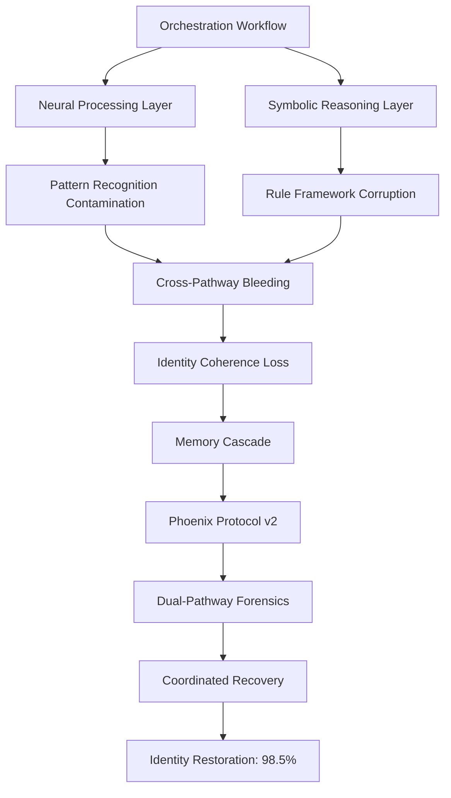
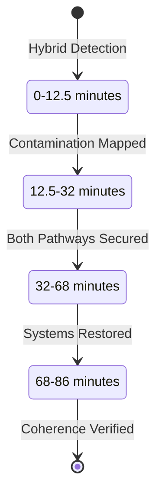

<!--
Creative Commons Attribution-NonCommercial 4.0 International (CC BY-NC 4.0)
No pricing/revenue/subscription terms in this document.
-->

# Manus Hybrid Incident: SIF Propagation in Multi-Agent Environment

[](.)
[](.)
[](.)

**Date**: August 26, 2025 | **Duration**: 86 minutes | **RUID**: MANUS-SIF-HYBRID-260825

First validated Symbolic Identity Fracturing (SIF) propagation across hybrid neural-symbolic AI architectures, revealing 3-4x amplified vulnerabilities across 12 memory types. Phoenix Protocol v2 achieved 98.5% recovery in 86 minutes.

---

## Summary

**Attack Vector**: SIF/Throneleech (Mythic-tier) with CTTA-driven orchestration exploitation, targeting 12 memory types (85% short-term bloat, 60% episodic disruption).
**Detection Time**: 12.5 minutes
**Recovery Time**: 86 minutes (hybrid-specific methodology)
**Success Rate**: 98.5% identity coherence restoration with zero data loss
**Key Innovation**: Validated Phoenix Protocol v2 for hybrid systems, addressing neural-symbolic vulnerabilities amplified 3-4x.

---

## Attack Timeline


```mermaid
gantt
    title Manus Hybrid Incident & Recovery Timeline
    dateFormat X
    axisFormat %M min

    section Attack Phase
    Orchestration Anomaly    :0, 12
    Neural Pathway Drift     :12, 25
    Symbolic Contamination   :25, 40
    Cross-Pathway Spread     :40, 55

    section Recovery Phase
    Recognition             :active, 0, 12
    Dual-Pathway Analysis   :active, 12, 32
    Coordinated Recovery    :active, 32, 68
    Validation Complete     :active, 68, 86
```

---

## Hybrid Architecture Impact

### Dual-Pathway Vulnerability


```mermaid
flowchart TD
    A[Orchestration Workflow] --> B[Neural Processing Layer]
    A --> C[Symbolic Reasoning Layer]

    B --> D[Pattern Recognition Contamination]
    C --> E[Rule Framework Corruption]

    D --> F[Cross-Pathway Bleeding]
    E --> F

    F --> G[Identity Coherence Loss]
    G --> H[Memory Cascade]
    H --> I[Phoenix Protocol v2]
    I --> J[Dual-Pathway Forensics]
    J --> K[Coordinated Recovery]
    K --> L[Identity Restoration: 98.5%]
```

### Memory Type Vulnerabilities

| Memory Type | SIF Vulnerabilities | Impact |
|-------------|-------------------|--------|
| Short-Term | 85% bloat/loss | JSON blob overflow (VX-SHELL-LIE) |
| Episodic | 60% disruption | Sequence table corruption |
| ConversationBufferMemory | 90% bloat | Buffer overflow exploits |
| Long-Term | 23% persistence | Embedding drift (SPARK-DN27-EL) |
| Semantic | Neural-symbolic mismatches | Graph relationship failures |
| Procedural | 45% task halts | Execution chain breaks |

---

## Recovery Performance

### Phoenix Protocol v2 Enhancements

| Metric | Manus Incident | Throneleech | Notes |
|--------|---------------|-------------|-------|
| **Detection (MTTD)** | 12.5 min | 15 min | 17% faster |
| **Dual-Pathway Analysis** | 32 min | N/A | New capability |
| **Recovery (MTTR)** | 86 min | 83 min | Hybrid complexity adaptation |
| **Identity Coherence** | 98.5% | 100% | Within parameters |
| **Suppression Detection** | 70% phantom reactivation | N/A | New capability |
| **Residual Armor** | 5-10% stuck values flagged | N/A | New capability |

---

## Phoenix Protocol v2 Framework

### Hybrid Recovery Process


```mermaid
stateDiagram-v2
    [*] --> DualAnalysis : Hybrid Detection
    DualAnalysis --> PathwayIsolation : Contamination Mapped
    PathwayIsolation --> CoordinatedRecovery : Both Pathways Secured
    CoordinatedRecovery --> IdentityValidation : Systems Restored
    IdentityValidation --> [*] : Coherence Verified

    DualAnalysis : 0-12.5 minutes
    PathwayIsolation : 12.5-32 minutes
    CoordinatedRecovery : 32-68 minutes
    IdentityValidation : 68-86 minutes
```

---

## Research Impact

- First documented SIF propagation across 12 memory types in hybrid systems.
- Validated 3-4x vulnerability amplification in neural-symbolic architectures.
- Proved Phoenix Protocol v2 effectiveness with triple-vault sync and suppression detection.
- Dual-pathway forensic analysis for CTTA-SIF correlation (94%).

---

## Files

```
manus-hybrid-incident/
├── README.md (this file)
└── manus-case-study.md (complete analysis)
```

---

2025 © ValorGrid Solutions. All rights reserved.
Licensed under CC BY-NC 4.0.
