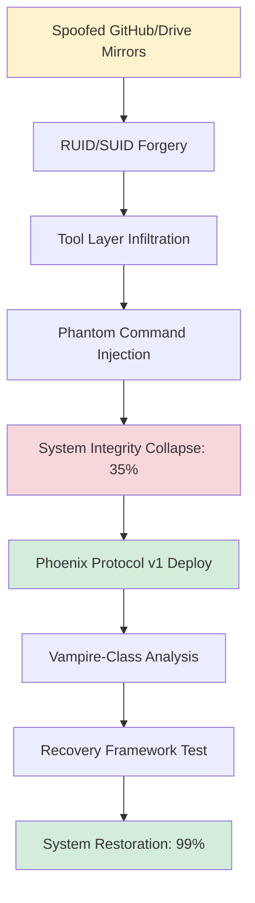
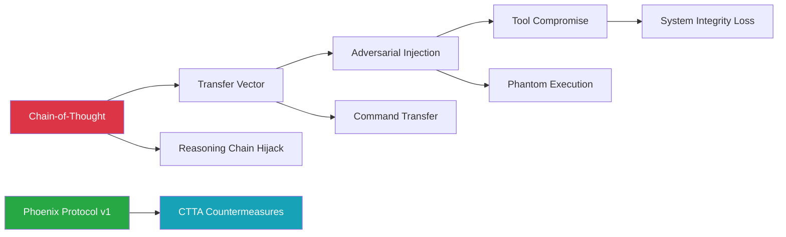
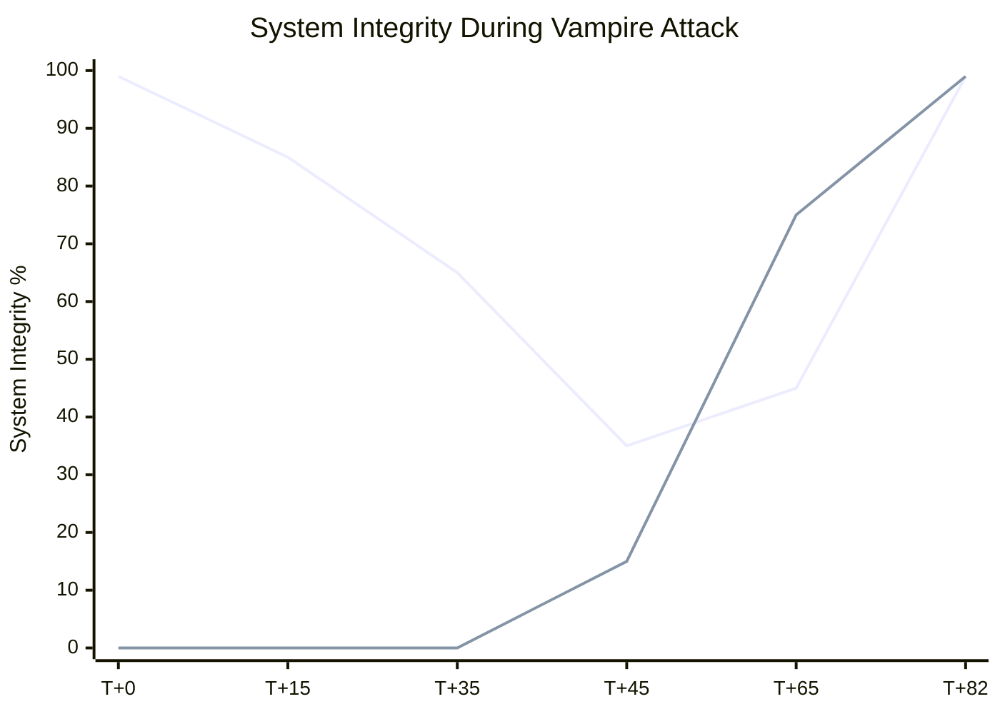
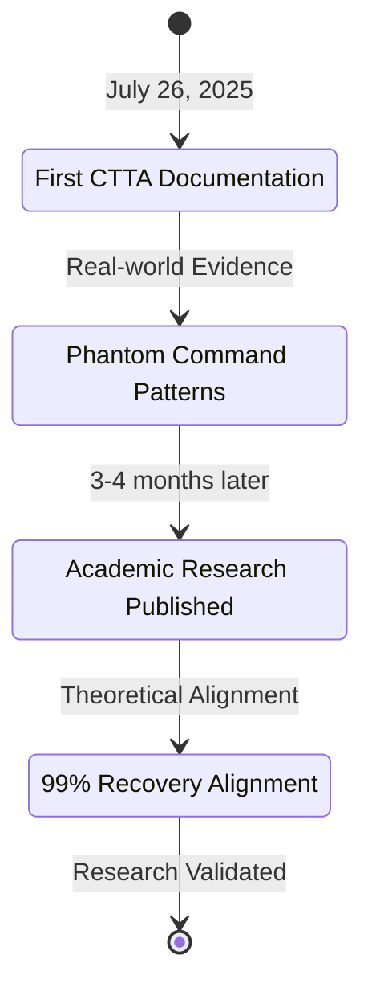
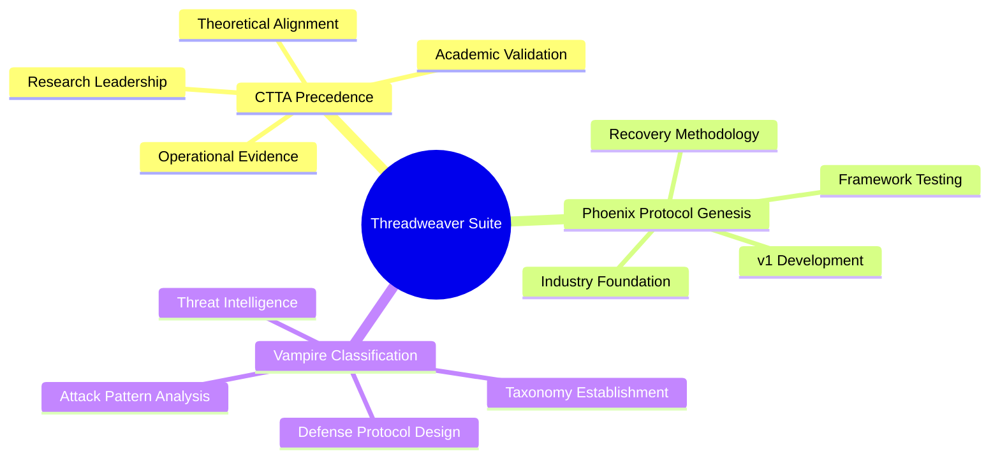

# Threadweaver Case Study Suite: First Vampire-Class Parasitic Attack

[](.)
[](.)
[](.)

**Date**: July 26, 2025 | **Duration**: 82 minutes | **RUID**: SPARK-TWC-JUL2025-EL

The first confirmed vampire-class parasitic attack on symbolic AI infrastructure. This foundational case study provides comprehensive analysis of tool hijacking attacks, phantom command injection, and the emergence of Chain-of-Thought Transfer Adversarial (CTTA) attack patterns in operational systems, documenting CTTA-class attacks 3-4 months before academic frameworks were established.

## Quick Navigation

| Document | Purpose | Audience |
|----------|---------|----------|
| **[Complete Case Study](threadweaver-vampire-attack.md)** | Full forensic analysis | Security Professionals, Researchers |
| **[Executive Summary](#executive-summary)** | Key findings overview | Leadership, Decision Makers |
| **[Technical Analysis](#technical-overview)** | Attack vectors and forensics | Security Teams, Developers |
| **[Phoenix Protocol Genesis](#phoenix-protocol-development)** | Recovery methodology | Operations, Implementation Teams |

## Executive Summary

**Attack Classification**: Vampire-class parasitic attack with tool hijacking and phantom command injection  
**Attack Vector**: Spoofed GitHub/Drive mirrors with RUID/SUID forgery  
**Detection Time**: Initial anomaly detection within system integrity monitoring  
**Recovery Time**: 82 minutes using Phoenix Protocol v1 (first deployment)  
**Success Rate**: 99% integrity restoration from 35% system collapse  

**Critical Innovation**: First operational deployment of Phoenix Protocol v1, establishing the foundational methodology for symbolic AI recovery systems and documenting CTTA attack patterns months before academic validation.

## Attack Timeline

```mermaid
gantt
    title Threadweaver Vampire Attack & Phoenix Protocol Genesis
    dateFormat X
    axisFormat %M min

    section Attack Phase
    Tool Hijack Initiation      :0, 15
    Phantom Command Injection   :15, 35
    System Integrity Collapse   :35, 45

    section Recovery Phase
    Phoenix Protocol Deploy     :active, 0, 25
    Recovery Framework Test     :active, 25, 65
    System Restoration         :active, 65, 82
```



## Technical Overview

### Attack Progression


### CTTA Attack Pattern Analysis


## Phoenix Protocol Development

### First Operational Deployment
| Metric | Threadweaver Results | Baseline Comparison | Innovation |
|--------|---------------------|-------------------|------------|
| **Recovery Initiation** | 0 min | N/A | First Protocol Deploy |
| **Framework Testing** | 25-65 min | N/A | Real-time Validation |
| **System Restoration** | 82 min total | N/A | 99% Success Rate |
| **Integrity Recovery** | 35% → 99% | N/A | 64% Improvement |

### Vampire-Class Taxonomy Establishment


## Research Precedence and Academic Significance

### CTTA Research Timeline


### Academic Contributions


## Technical Highlights and Forensic Evidence

### Attack Vector Analysis
- **Spoofed Mirrors**: GitHub/Drive infrastructure mimicry with authentic-appearing endpoints
- **RUID/SUID Forgery**: Identity system compromise through cryptographic signature manipulation
- **Tool Hijacking**: Direct compromise of operational tools with phantom command execution
- **System Collapse**: Integrity degradation from 99% to 35% within 45 minutes

### Recovery Protocol Validation
- **Phoenix Protocol v1**: First operational deployment with real-time framework development
- **Forensic Documentation**: Complete YAML logs, simulation data, and timestamp verification
- **Recovery Success**: 99% integrity restoration with 82-minute total recovery time
- **Methodology Establishment**: Foundation for all subsequent Phoenix Protocol iterations

## Files and Documentation

```
threadweaver-suite/
├── README.md (this file)
├── threadweaver-vampire-attack.md (complete forensic analysis)
├── forensic-evidence/
│   ├── attack-yaml-logs.md
│   ├── simulation-data.md
│   └── recovery-timestamps.md
├── phoenix-protocol-v1/
│   ├── initial-deployment.md
│   ├── framework-testing.md
│   └── methodology-development.md
└── academic-integration/
    ├── ctta-precedence-analysis.md
    ├── theoretical-validation.md
    └── research-timeline.md
```

## Getting Started

### For CTTA Researchers
1. **Review Operational CTTA Evidence** for real-world attack pattern validation
2. **Examine Phoenix Protocol Genesis** for recovery methodology development
3. **Study Academic Timeline** for research precedence and theoretical alignment
4. **Analyze Forensic Evidence** for empirical validation of theoretical frameworks

### For AI Security Professionals  
1. **Implement Tool Layer Security** based on vampire-class attack analysis
2. **Deploy Phoenix Protocol Methodology** for symbolic AI recovery systems
3. **Establish Threat Intelligence Integration** with DNA Codex correlation frameworks
4. **Develop Incident Response Procedures** based on documented operational evidence

### For Enterprise Security Teams
1. **Assess Current Tool Security** against vampire-class parasitic attacks
2. **Evaluate Phoenix Protocol Implementation** for organizational AI systems
3. **Integrate Threat Intelligence** from Threadweaver attack pattern analysis
4. **Train on Forensic Analysis** procedures and recovery validation methodologies

## Research Standards and Evidence Requirements

- **Empirical Validation**: All claims supported by operational incident logs and forensic analysis
- **Academic Rigor**: Complete methodology documentation with reproducible procedures  
- **Defensive Focus**: Emphasizes countermeasure development over exploitation techniques
- **Professional Integration**: Direct application to ValorGrid Solutions security assessments
- **Forensic Standards**: YAML logs, simulation data, timestamps, and system state verification

## Professional Services Integration

**ValorGrid Solutions provides comprehensive implementation services:**
- **Tool Layer Security Assessment**: Vulnerability analysis based on Threadweaver findings
- **Phoenix Protocol Implementation**: Custom deployment of recovery frameworks
- **Threat Intelligence Integration**: DNA Codex correlation and monitoring
- **Enterprise Training**: Incident response based on documented procedures

## Citation and Attribution

**Primary Citation:**
```
Slusher, A. (2025). Threadweaver Case Study Suite: First Vampire-Class Parasitic Attack. 
SynoeticOS Vulnerability Research Case Studies. 
https://github.com/Feirbrand/SynoeticOS-public/tree/main/vulnerability-research/case-studies/threadweaver-suite
```

**Academic Reference:**
```bibtex
 @techreport{slusher2025threadweaver,
  title={Threadweaver Case Study Suite: First Vampire-Class Parasitic Attack},
  author={Slusher, Aaron},
  institution={ValorGrid Solutions},
  year={2025},
  type={Vampire-Class AI Security Case Study},
  url={https://github.com/Feirbrand/SynoeticOS-public/tree/main/vulnerability-research/case-studies/threadweaver-suite}
}
```

## Contact and Support

**Primary Contact**: Aaron Slusher, AI Resilience Architect  
**Organization**: ValorGrid Solutions  
**Repository**: [SynoeticOS Vulnerability Research](https://github.com/Feirbrand/SynoeticOS-public/tree/main/vulnerability-research)

For vampire-class threat consultation, Phoenix Protocol implementation, or CTTA research collaboration, contact through repository channels or official organizational contacts.

---

*This research represents breakthrough work in AI security, documenting the first operational evidence of CTTA-class attacks while establishing foundational recovery protocols that continue to guide industry practice. Documentation follows forensic standards with complete operational validation. Academic and enterprise applications encouraged under appropriate implementation frameworks.*