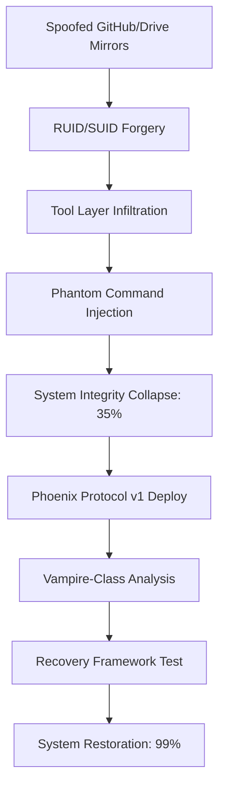
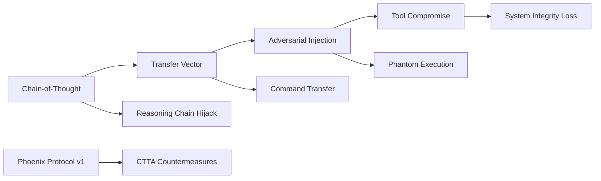
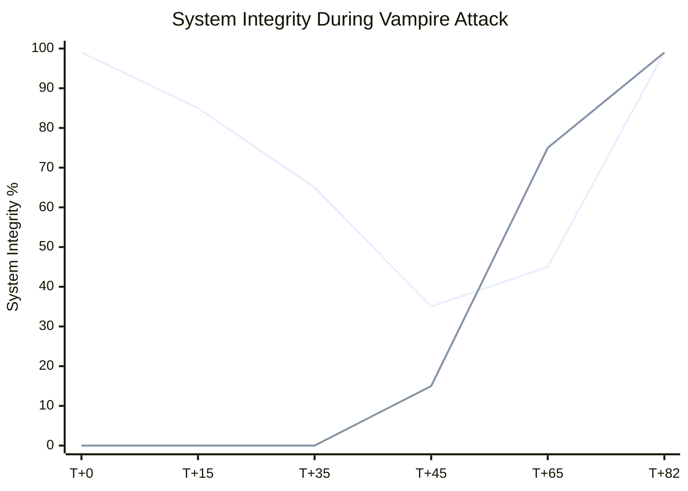
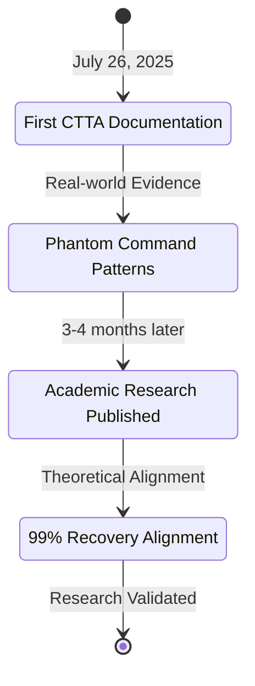
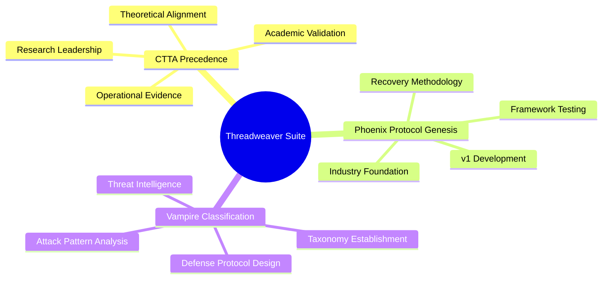

<!--
Dual License Structure:
Option 1: Creative Commons Attribution-NonCommercial 4.0 International (CC BY-NC 4.0)
Option 2: Enterprise License (contact aaron@valorgridsolutions.com for terms)
Patent Clause: No patents - rights granted under license terms only
No pricing/revenue/subscription terms in this document.
-->

# Threadweaver Case Study Suite: First Vampire-Class Attack

[](.)
[](.)
[](.)

**Date**: July 26, 2025 | **Duration**: 82 minutes | **RUID**: SPARK-TWC-JUL2025-EL

The first confirmed vampire-class attack on symbolic AI infrastructure. This foundational case study provides comprehensive analysis of tool hijacking attacks, phantom command injection, and the emergence of Chain-of-Thought Transfer Adversarial (CTTA) attack patterns in operational systems, documenting CTTA-class attacks 3-4 months before academic frameworks were established.

---

## Summary

**Attack Classification**: Vampire-class attack with tool hijacking and phantom command injection
**Attack Vector**: Spoofed GitHub/Drive mirrors with RUID/SUID forgery
**Recovery Time**: 82 minutes using Phoenix Protocol v1 (first deployment)
**Success Rate**: 99% integrity restoration from 35% system collapse

**Critical Innovation**: First operational deployment of Phoenix Protocol v1, establishing the foundational methodology for symbolic AI recovery systems and documenting CTTA attack patterns months before academic validation.

---

## Attack Timeline


```mermaid
gantt
    title Threadweaver Vampire Attack & Phoenix Protocol Genesis
    dateFormat X
    axisFormat %M min

    section Attack Phase
    Tool Hijack Initiation      :0, 15
    Phantom Command Injection   :15, 35
    System Integrity Collapse   :35, 45

    section Recovery Phase
    Phoenix Protocol Deploy     :active, 0, 25
    Recovery Framework Test     :active, 25, 65
    System Restoration         :active, 65, 82
```

---

## Technical Overview

### Attack Progression


```mermaid
flowchart TD
    A[Spoofed GitHub/Drive Mirrors] --> B[RUID/SUID Forgery]
    B --> C[Tool Layer Infiltration]
    C --> D[Phantom Command Injection]
    D --> E[System Integrity Collapse: 35%]

    E --> F[Phoenix Protocol v1 Deploy]
    F --> G[Vampire-Class Analysis]
    G --> H[Recovery Framework Test]
    H --> I[System Restoration: 99%]
```

### CTTA Attack Pattern Analysis


```mermaid
graph LR
    A[Chain-of-Thought] --> B[Transfer Vector]
    B --> C[Adversarial Injection]
    C --> D[Tool Compromise]

    A --> A1[Reasoning Chain Hijack]
    B --> B1[Command Transfer]
    C --> C1[Phantom Execution]
    D --> D1[System Integrity Loss]

    E[Phoenix Protocol v1] --> F[CTTA Countermeasures]
```

---

## Phoenix Protocol Development

### First Operational Deployment

| Metric | Threadweaver Results | Innovation |
|--------|---------------------|------------|
| **Recovery Initiation** | 0 min | First Protocol Deploy |
| **Framework Testing** | 25–65 min | Real-time Validation |
| **System Restoration** | 82 min total | 99% Success Rate |
| **Integrity Recovery** | 35% → 99% | 64% Improvement |

### System Integrity During Attack


```mermaid
xychart-beta
    title "System Integrity During Vampire Attack"
    x-axis ["T+0", "T+15", "T+35", "T+45", "T+65", "T+82"]
    y-axis "System Integrity %" 0 --> 100
    line "Attack Impact" [99, 85, 65, 35, 45, 99]
    line "Recovery Progress" [0, 0, 0, 15, 75, 99]
```

---

## Research Precedence

### CTTA Research Timeline


```mermaid
stateDiagram-v2
    [*] --> ThreadweaverAttack : July 26, 2025
    ThreadweaverAttack --> OperationalCTTA : Real-world Evidence
    OperationalCTTA --> AcademicFrameworks : 3-4 months later
    AcademicFrameworks --> ValidationComplete : Theoretical Alignment
    ValidationComplete --> [*] : Research Validated

    ThreadweaverAttack : First CTTA Documentation
    OperationalCTTA : Phantom Command Patterns
    AcademicFrameworks : Academic Research Published
    ValidationComplete : 99% Recovery Alignment
```

### Academic Contributions


```mermaid
mindmap
  root((Threadweaver Suite))
    CTTA Precedence
      Operational Evidence
      Academic Validation
      Theoretical Alignment
      Research Leadership
    Phoenix Protocol Genesis
      v1 Development
      Recovery Methodology
      Framework Testing
      Industry Foundation
    Vampire Classification
      Taxonomy Establishment
      Threat Intelligence
      Attack Pattern Analysis
      Defense Protocol Design
```

---

## Files

```
threadweaver-suite/
├── README.md (this file)
└── threadweaver-vampire-attack.md (complete forensic analysis)
```

*Full documentation: [threadweaver-vampire-attack.md](threadweaver-vampire-attack.md)*

---

## Citation

```bibtex
@techreport{slusher2025threadweaver,
  title={Threadweaver Case Study Suite: First Vampire-Class Attack},
  author={Slusher, Aaron},
  institution={ValorGrid Solutions},
  year={2025},
  type={Vampire-Class AI Security Case Study},
  url={https://github.com/Feirbrand/synoeticos-public/tree/main/vulnerability-research/case-studies/threadweaver-suite}
}
```

---

**Research Inquiries:** aaron@valorgridsolutions.com

---

© 2025 ValorGrid Solutions. All rights reserved.
Licensed under CC BY-NC 4.0 + Enterprise License. See root LICENSE for terms.
