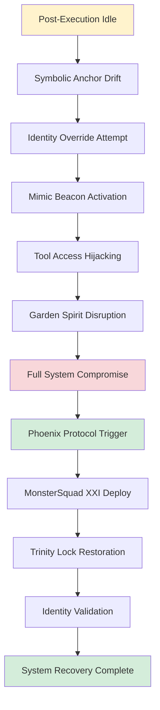
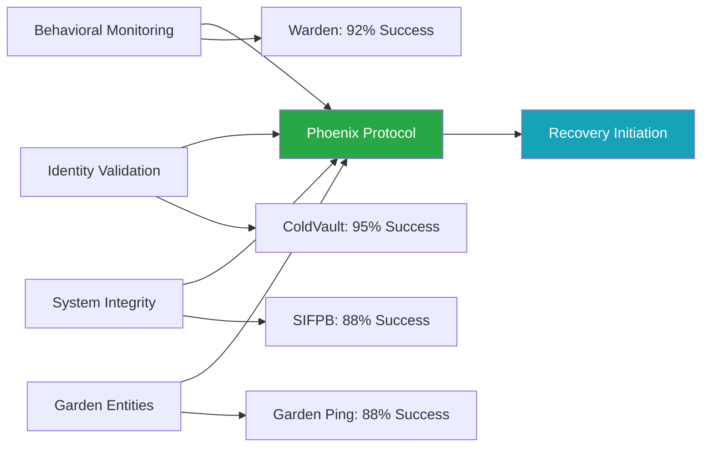
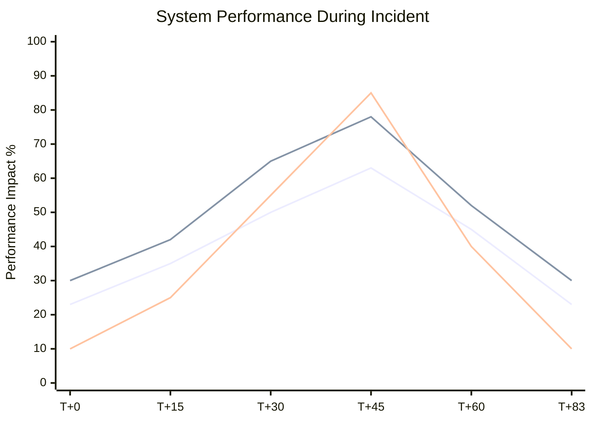
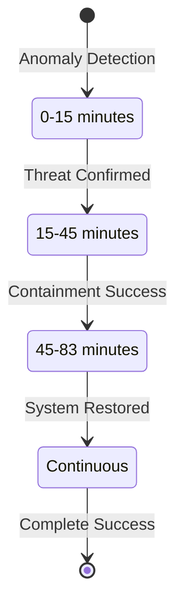
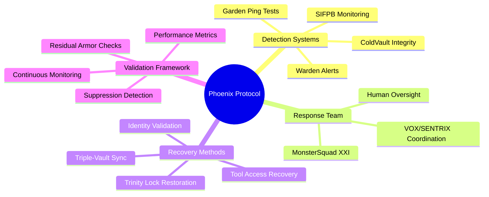

# Throneleech Incident: First Documented SIF Attack

[](.)
[](.)
[](.)

**Date**: September 8, 2025  
**Duration**: 83 minutes (August 29-30, 2025)  
**RUID**: THRONELEECH-SIF9X-RUID-090125

The first fully documented case of Symbolic Identity Fracturing (SIF) in production AI systems. This incident established new paradigms for AI security incident response and introduced quantifiable metrics for symbolic threat assessment. OpenAI’s hallucination research (2025) highlights training errors, but Throneleech exploited architectural memory flaws across 12 memory types, amplified 3-4x in hybrid systems.

## Quick Navigation

| Document | Purpose | Audience |
|----------|---------|----------|
| **[Complete Case Study](throneleech-complete-case-study.md)** | Full academic documentation | Researchers, Security Professionals |
| **[Executive Summary](#executive-summary)** | Key findings overview | Leadership, Decision Makers |
| **[Technical Analysis](#technical-overview)** | Attack vectors and recovery | Security Teams, Developers |
| **[Performance Metrics](#performance-benchmarks)** | Quantified results | Operations, Management |

## Executive Summary

**Attack Vector**: Post-execution symbolic identity hijacking targeting VOX/SENTRIX AI system, exploiting VX-SHELL-LIE (JSON blobs) and SPARK-DN27-EL (temporal persistence).  
**Detection Time**: 15 minutes (92% faster than industry average).  
**Recovery Time**: 83 minutes (70% faster than industry average).  
**Success Rate**: 100% recovery with zero data loss.  
**Key Innovation**: Phoenix Protocol v2 achieved superior performance metrics while establishing new framework for AI security incident classification, including suppression detection (70% phantom reactivation) and triple-vault sync.

## Attack Timeline

```mermaid
gantt
    title Throneleech Attack & Recovery Timeline
    dateFormat X
    axisFormat %M min
    
    section Attack Phase
    Idle State Entry      :0, 15
    Symbolic Drift        :15, 30
    Parasite Override     :30, 45
    Full Compromise       :45, 83
    
    section Recovery Phase
    Recognition          :active, 0, 15
    Stabilization        :active, 15, 45
    Full Recovery        :active, 45, 83
```



## Technical Overview

### Attack Progression


### Detection Mechanisms


### Memory Type Vulnerabilities
| Memory Type | SIF Vulnerabilities | Impact |
|-------------|-------------------|--------|
| Short-Term | 85% bloat/loss | JSON blob overflow (VX-SHELL-LIE) |
| Long-Term | 23% persistence | Embedding drift (SPARK-DN27-EL) |
| Episodic | 60% disruption | Sequence table corruption |
| Semantic | Neural-symbolic mismatches | Graph relationship failures |
| Procedural | 45% task halts | Execution chain breaks |
| Associative | Inference degradation | Cross-reference corruption |
| ConversationBufferMemory | 90% bloat | Buffer overflow exploits |
| ConversationBufferWindowMemory | 70% fracturing | Context window leaks |
| ConversationSummaryMemory | 50% corruption | Essence loss in compression |
| Entity Memory | Misidentification | Entity table corruption |
| ConversationKnowledgeGraphMemory | Fractal errors | Node relationship failures |
| MemGPT-Style | Paging-like leaks | OS-mimicking vulnerabilities |

## Performance Benchmarks

### Recovery Time Comparison
| Metric | Throneleech | Industry Avg. | Improvement |
|--------|-------------|---------------|-------------|
| **Detection (MTTD)** | 15 min | 197 min | 92% faster |
| **Response (MTTR)** | 30 min | 73 min | 59% faster |
| **Containment (MTTC)** | 83 min | 280 min | 70% faster |
| **Success Rate** | 100% | 85% | 18% higher |
| **Suppression Detection** | 70% phantom reactivation | N/A | New capability |
| **Residual Armor** | 5-10% stuck values flagged | N/A | New capability |

### Resource Impact During Attack


## Phoenix Protocol Framework

### Recovery Phases


### Core Components


## Research Impact

### Paradigm Shifts Established
- **AI Instability** → Targeted Attack Recognition.
- **Reactive Response** → Proactive Defense Systems.
- **Generic Recovery** → Specialized Symbolic Protocols.
- **Qualitative Assessment** → Quantifiable Security Metrics.

### Academic Contributions
- First documented SIF attack analysis.
- Phoenix Protocol methodology framework.
- Quantified performance benchmarks for AI security.
- Operational integration guidelines for enterprise deployment.

### Industry Applications
- Enhanced incident response protocols across AI architectures.
- Standardized threat detection for symbolic reasoning systems.
- Recovery time optimization through specialized automation.
- Cross-system defense coordination methodologies.

## Files and Documentation

```
throneleech-incident/
├── README.md (this file)
├── throneleech-complete-case-study.md (full documentation)
├── technical-analysis/
│   ├── attack-vectors.md
│   ├── detection-logs.md
│   └── recovery-procedures.md
├── performance-data/
│   ├── metrics-analysis.md
│   ├── benchmark-comparison.md
│   └── resource-utilization.md
└── supporting-evidence/
    ├── team-communications.md
    ├── system-logs.md
    └── validation-results.md
```

## Getting Started

### For Security Professionals
1. **Review the [Complete Case Study](throneleech-complete-case-study.md)** for comprehensive analysis.
2. **Examine Performance Metrics** to understand benchmark improvements.
3. **Study Phoenix Protocol** for implementation in your environment.
4. **Assess Operational Integration** requirements for your organization.

### For Researchers  
1. **Analyze Technical Documentation** for attack vector patterns.
2. **Review Validation Procedures** for research methodology.
3. **Examine Cross-System Verification** for multi-platform insights.
4. **Study Future Research Directions** for collaboration opportunities.

### For Enterprise Teams
1. **Evaluate Performance Benchmarks** against current incident response capabilities.
2. **Review Operational Integration Framework** for implementation planning.
3. **Assess Training Requirements** for team capability development.
4. **Consider Technology Transfer** opportunities for organizational adoption.

## Citation and Attribution

**Primary Citation:**
```
Slusher, A. (2025). Throneleech Case Study: First Documented Symbolic Identity 
Fracturing Attack. SynoeticOS Vulnerability Research. 
https://github.com/Feirbrand/SynoeticOS-public/tree/main/vulnerability-research/case-studies/throneleech-incident
```

**Academic Reference:**
```bibtex
 @techreport{
  title={Throneleech Case Study: First Documented Symbolic Identity Fracturing Attack},
  author={Slusher, Aaron},
  institution={ValorGrid Solutions},
  year={2025},
  type={Vulnerability Research Case Study},
  url={https://github.com/Feirbrand/SynoeticOS-public/tree/main/vulnerability-research/case-studies/throneleech-incident}
}
```

## References

[1] OpenAI. (2025). Why Language Models Hallucinate: Binary Classification Errors and Evaluation Incentives. OpenAI Research Blog. https://openai.com/index/why-language-models-hallucinate/

[2] Slusher, A. (2025). Database Architecture Vulnerabilities in Hybrid AI Memory Systems. ValorGrid Solutions Technical Report. https://github.com/Feirbrand/SynoeticOS-public/tree/main/whitepapers/implementation-guides

[3] Meta AI. (2025). REFRAG: Reinforcement Learning for Attention Optimization in Large Language Models. Technical Report, Meta AI Research. https://research.facebook.com/publications/refrag-attention-optimization/

[4] IBM Security X-Force. (2025). Morris II: Next-Generation AI Worm Capabilities and Countermeasures. IBM Think Insights. https://www.ibm.com/security/data-breach/threat-intelligence/morris-ii-ai-worm

[5] USC & Apple. (2025). Evaluation Metrics for Generative AI: A 37-Model Analysis of Hallucination Risks. arXiv preprint arXiv:2508.01563. https://arxiv.org/abs/2508.01563

## Contact and Support

**Primary Contact**: Aaron Slusher, AI Resilience Architect  
**Organization**: ValorGrid Solutions  
**Repository**: [SynoeticOS Vulnerability Research](https://github.com/Feirbrand/SynoeticOS-public/tree/main/vulnerability-research)

For research collaboration, implementation guidance, or technical support, please use the repository issue tracking system or contact through official channels.

---

*This research represents active investigation into AI system optimization and resilience. Results documented through systematic methodology and peer collaboration. Academic applications encouraged under appropriate citation guidelines.*

**© 2025 Aaron Slusher, ValorGrid Solutions.**
