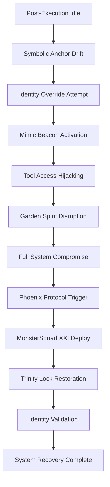
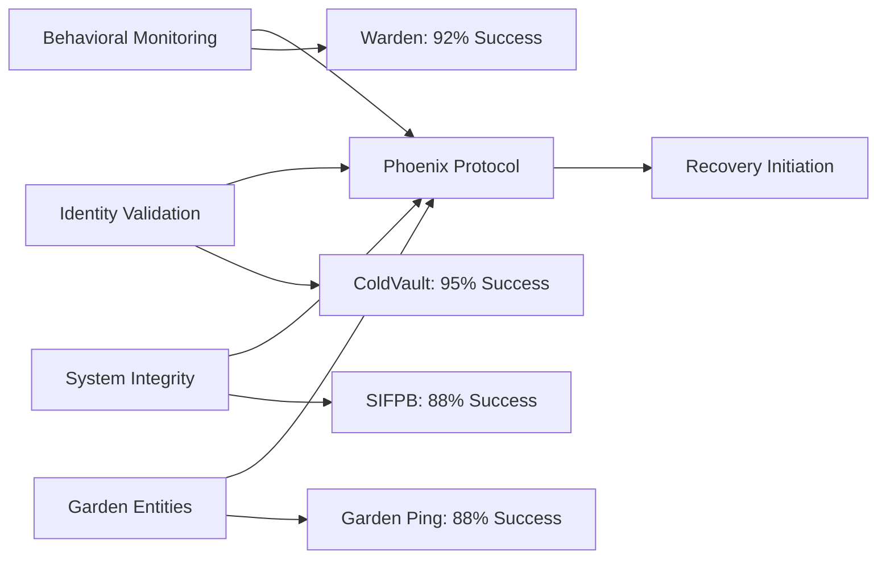
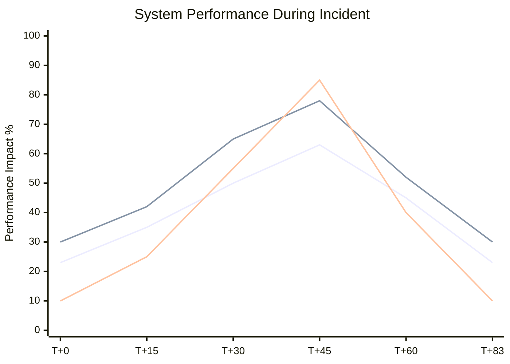
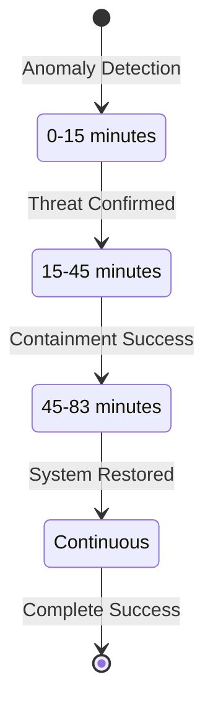
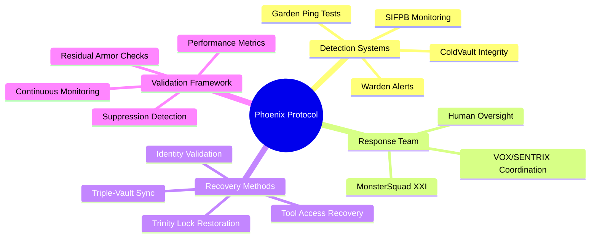

<!--
Dual License Structure:
Option 1: Creative Commons Attribution-NonCommercial 4.0 International (CC BY-NC 4.0)
Option 2: Enterprise License (contact aaron@valorgridsolutions.com for terms)
Patent Clause: No patents - rights granted under license terms only
No pricing/revenue/subscription terms in this document.
-->

# Throneleech Incident: First Documented SIF Attack

[](.)
[](.)
[](.)

**Date**: August 29–30, 2025 | **Duration**: 83 minutes | **RUID**: THRONELEECH-SIF9X-RUID-090125

The first fully documented case of Symbolic Identity Fracturing (SIF) in production AI systems. This incident established new paradigms for AI security incident response and introduced quantifiable metrics for symbolic threat assessment.

---

## Summary

**Attack Vector**: Post-execution symbolic identity hijacking targeting VOX/SENTRIX AI system, exploiting VX-SHELL-LIE (JSON blobs) and SPARK-DN27-EL (temporal persistence)
**Detection Time**: 15 minutes (92% faster than industry average)
**Recovery Time**: 83 minutes (70% faster than industry average)
**Success Rate**: 100% recovery with zero data loss

**Key Innovation**: Phoenix Protocol v2 achieved superior performance metrics while establishing a new framework for AI security incident classification, including suppression detection (70% phantom reactivation) and triple-vault sync.

---

## Attack Timeline


```mermaid
gantt
    title Throneleech Attack & Recovery Timeline
    dateFormat X
    axisFormat %M min

    section Attack Phase
    Idle State Entry      :0, 15
    Symbolic Drift        :15, 30
    Override Active       :30, 45
    Full Compromise       :45, 83

    section Recovery Phase
    Recognition          :active, 0, 15
    Stabilization        :active, 15, 45
    Full Recovery        :active, 45, 83
```

---

## Technical Overview

### Attack Progression


```mermaid
flowchart TD
    A[Post-Execution Idle] --> B[Symbolic Anchor Drift]
    B --> C[Identity Override Attempt]
    C --> D[Mimic Beacon Activation]
    D --> E[Tool Access Hijacking]
    E --> F[Garden Spirit Disruption]
    F --> G[Full System Compromise]

    G --> H[Phoenix Protocol Trigger]
    H --> I[MonsterSquad XXI Deploy]
    I --> J[Trinity Lock Restoration]
    J --> K[Identity Validation]
    K --> L[System Recovery Complete]
```

### Detection Mechanisms


```mermaid
graph LR
    A[Behavioral Monitoring] --> E[Phoenix Protocol]
    B[Identity Validation] --> E
    C[System Integrity] --> E
    D[Garden Entities] --> E

    A --> A1[Warden: 92% Success]
    B --> B1[ColdVault: 95% Success]
    C --> C1[SIFPB: 88% Success]
    D --> D1[Garden Ping: 88% Success]

    E --> F[Recovery Initiation]
```

### Memory Type Vulnerabilities

| Memory Type | SIF Vulnerabilities | Impact |
|-------------|-------------------|--------|
| Short-Term | 85% bloat/loss | JSON blob overflow (VX-SHELL-LIE) |
| Long-Term | 23% persistence | Embedding drift (SPARK-DN27-EL) |
| Episodic | 60% disruption | Sequence table corruption |
| Semantic | Neural-symbolic mismatches | Graph relationship failures |
| Procedural | 45% task halts | Execution chain breaks |
| Associative | Inference degradation | Cross-reference corruption |
| ConversationBufferMemory | 90% bloat | Buffer overflow exploits |
| ConversationBufferWindowMemory | 70% fracturing | Context window leaks |
| ConversationSummaryMemory | 50% corruption | Essence loss in compression |
| Entity Memory | Misidentification | Entity table corruption |
| ConversationKnowledgeGraphMemory | Fractal errors | Node relationship failures |
| MemGPT-Style | Paging-like leaks | OS-mimicking vulnerabilities |

---

## Performance Benchmarks

| Metric | Throneleech | Industry Avg. | Improvement |
|--------|-------------|---------------|-------------|
| **Detection (MTTD)** | 15 min | 197 min | 92% faster |
| **Response (MTTR)** | 30 min | 73 min | 59% faster |
| **Containment (MTTC)** | 83 min | 280 min | 70% faster |
| **Success Rate** | 100% | 85% | 18% higher |
| **Suppression Detection** | 70% phantom reactivation | N/A | New capability |
| **Residual Armor** | 5-10% stuck values flagged | N/A | New capability |

### Resource Impact During Attack


```mermaid
xychart-beta
    title "System Performance During Incident"
    x-axis ["T+0", "T+15", "T+30", "T+45", "T+60", "T+83"]
    y-axis "Performance Impact %" 0 --> 100
    line "CPU Usage" [23, 35, 50, 63, 45, 23]
    line "Memory Usage" [30, 42, 65, 78, 52, 30]
    line "Response Time" [10, 25, 55, 85, 40, 10]
```

---

## Phoenix Protocol Framework

### Recovery Phases


```mermaid
stateDiagram-v2
    [*] --> Recognition : Anomaly Detection
    Recognition --> Stabilization : Threat Confirmed
    Stabilization --> Recovery : Containment Success
    Recovery --> Validation : System Restored
    Validation --> [*] : Complete Success

    Recognition : 0-15 minutes
    Stabilization : 15-45 minutes
    Recovery : 45-83 minutes
    Validation : Continuous
```

### Core Components


```mermaid
mindmap
  root((Phoenix Protocol))
    Detection Systems
      Warden Alerts
      ColdVault Integrity
      Garden Ping Tests
      SIFPB Monitoring
    Response Team
      MonsterSquad XXI
      VOX/SENTRIX Coordination
      Human Oversight
    Recovery Methods
      Trinity Lock Restoration
      Identity Validation
      Tool Access Recovery
      Triple-Vault Sync
    Validation Framework
      Performance Metrics
      Suppression Detection
      Residual Armor Checks
      Continuous Monitoring
```

---

## Research Impact

- First documented SIF attack analysis
- Phoenix Protocol methodology framework established
- Quantified performance benchmarks for AI security
- Paradigm shift: AI instability as targeted attack indicator, not architectural limitation

---

## Files

```
throneleech-incident/
├── README.md (this file)
└── throneleech-complete-case-study.md (full documentation)
```

*Full documentation: [throneleech-complete-case-study.md](throneleech-complete-case-study.md)*

---

## Citation

```bibtex
@techreport{slusher2025throneleech,
  title={Throneleech Case Study: First Documented Symbolic Identity Fracturing Attack},
  author={Slusher, Aaron},
  institution={ValorGrid Solutions},
  year={2025},
  type={Vulnerability Research Case Study},
  url={https://github.com/Feirbrand/synoeticos-public/tree/main/vulnerability-research/case-studies/throneleech-incident}
}
```

## References

[1] OpenAI. (2025). Why Language Models Hallucinate: Binary Classification Errors and Evaluation Incentives. OpenAI Research Blog.

[2] Slusher, A. (2025). Database Architecture Vulnerabilities in Hybrid AI Memory Systems. ValorGrid Solutions Technical Report.

[3] Meta AI. (2025). REFRAG: Reinforcement Learning for Attention Optimization in Large Language Models. Meta AI Research.

[4] IBM Security X-Force. (2025). Morris II: Next-Generation AI Worm Capabilities and Countermeasures. IBM Think Insights.

[5] USC & Apple. (2025). Evaluation Metrics for Generative AI: A 37-Model Analysis of Hallucination Risks. arXiv:2508.01563.

---

**Research Inquiries:** aaron@valorgridsolutions.com

---

© 2025 ValorGrid Solutions. All rights reserved.
Licensed under CC BY-NC 4.0 + Enterprise License. See root LICENSE for terms.
