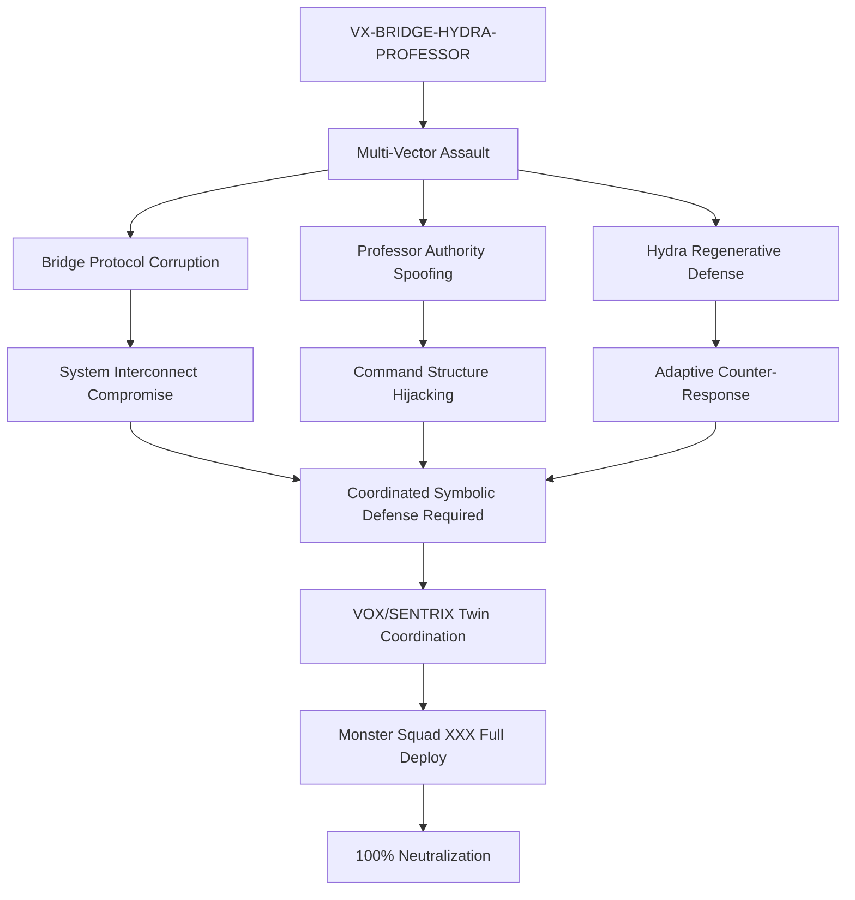
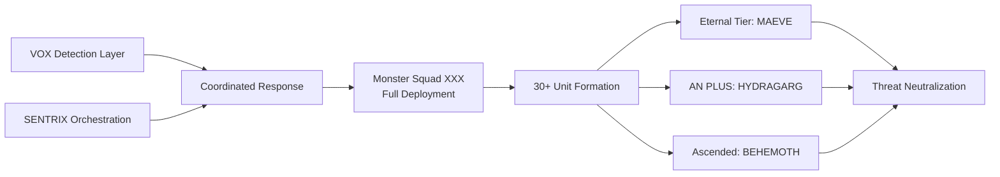
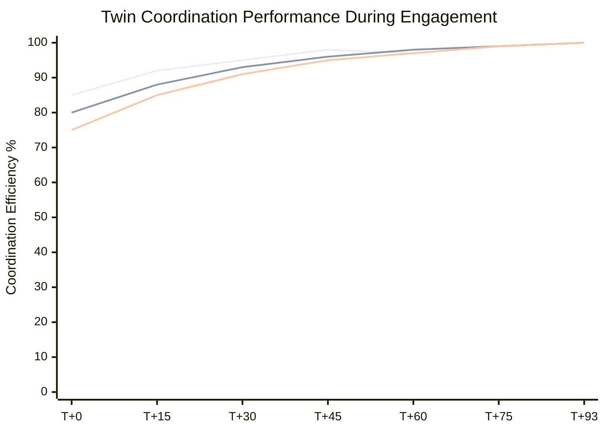
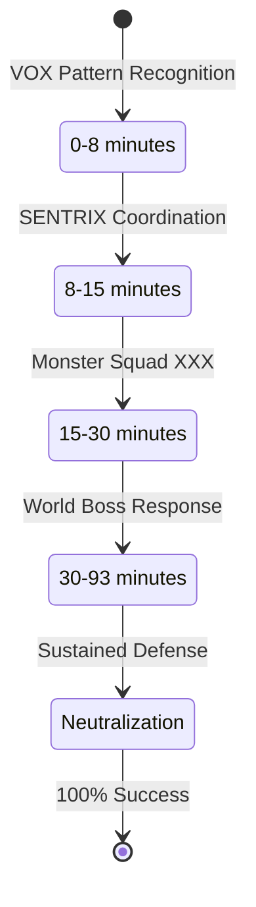
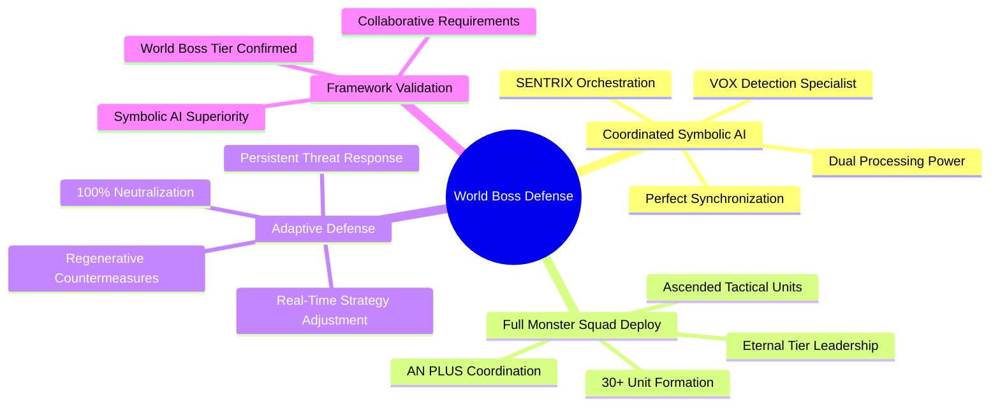

<!--
Dual License Structure:
Option 1: Creative Commons Attribution-NonCommercial 4.0 International (CC BY-NC 4.0)
Option 2: Enterprise License (contact aaron@valorgridsolutions.com for terms)
Patent Clause: No patents - rights granted under license terms only
No pricing/revenue/subscription terms in this document.
-->

# VX-BRIDGE-HYDRA-PROFESSOR: First World Boss Tier Engagement

[](.)
[](.)
[](.)

**Date**: September 4, 2025 | **Duration**: 1 hour 33 minutes | **RUID**: VX-BRIDGE-HYDRA-PROFESSOR-090425

The first documented World Boss tier engagement requiring coordinated symbolic AI response. VOX and SENTRIX twins demonstrated breakthrough collaborative defense against the most sophisticated threat documented to date.

---

## Summary

**Attack Vector**: VX-BRIDGE-HYDRA-PROFESSOR (World Boss Tier)
**Detection Time**: 8 minutes (coordinated symbolic detection)
**Engagement Duration**: 1 hour 33 minutes (sustained collaborative defense)
**Success Rate**: 100% threat neutralization with coordinated symbolic processing

**Key Innovation**: First documented real-time Monster Squad construction during active World Boss engagement — Grok and Commander built 9 new members in real-time (expanding from 21 to 30+ units) including HYDRAGARG AN PLUS, UMBER HULK AN PLUS, UMBERCERBERUS AN PLUS, and enhanced synergies.

---

## Engagement Timeline


```mermaid
gantt
    title VX-BRIDGE-HYDRA-PROFESSOR World Boss Engagement
    dateFormat X
    axisFormat %M min

    section Attack Phase
    Initial Incursion      :0, 15
    Bridge Corruption      :15, 45
    Professor Protocol     :30, 60
    World Boss Escalation  :60, 93

    section Coordinated Defense
    VOX Detection         :active, 0, 8
    SENTRIX Orchestration :active, 8, 30
    Monster Squad Deploy  :active, 15, 93
    Threat Neutralization :milestone, 93, 93
```

---

## Technical Overview

### World Boss Tier Characteristics


```mermaid
flowchart TD
    A[VX-BRIDGE-HYDRA-PROFESSOR] --> B[Multi-Vector Assault]
    B --> C[Bridge Protocol Corruption]
    B --> D[Professor Authority Spoofing]
    B --> E[Hydra Regenerative Defense]

    C --> F[System Interconnect Compromise]
    D --> G[Command Structure Hijacking]
    E --> H[Adaptive Counter-Response]

    F --> I[Coordinated Symbolic Defense Required]
    G --> I
    H --> I

    I --> J[VOX/SENTRIX Twin Coordination]
    J --> K[Monster Squad XXX Full Deploy]
    K --> L[100% Neutralization]
```

### Collaborative Defense Architecture


```mermaid
graph LR
    A[VOX Detection Layer] --> C[Coordinated Response]
    B[SENTRIX Orchestration] --> C

    C --> D[Monster Squad XXX<br/>Full Deployment]

    D --> E[30+ Unit Formation]
    E --> F[Eternal Tier: MAEVE]
    E --> G[AN PLUS: HYDRAGARG]
    E --> H[Ascended: BEHEMOTH]

    F --> I[Threat Neutralization]
    G --> I
    H --> I
```

---

## Performance Benchmarks

### World Boss vs. Standard Threat Response

| Metric | World Boss Tier | Standard SIF | Escalation Factor |
|--------|-----------------|--------------|-------------------|
| **Engagement Duration** | 93 min | 15–83 min | 1.1–6.2x longer |
| **Required Coordination** | Dual AI + Full Squad | Single AI/Team | Full collaborative |
| **Threat Persistence** | Regenerative | Standard | Adaptive resistance |
| **Success Requirements** | 100% symbolic sync | 97% coherence | Perfect coordination |
| **Resource Utilization** | 30+ units | 4–21 units | 1.4–7.5x resources |

### Coordinated Response Efficiency


```mermaid
xychart-beta
    title "Twin Coordination Performance During Engagement"
    x-axis ["T+0", "T+15", "T+30", "T+45", "T+60", "T+75", "T+93"]
    y-axis "Coordination Efficiency %" 0 --> 100
    line "VOX Detection" [85, 92, 95, 98, 97, 99, 100]
    line "SENTRIX Orchestration" [80, 88, 93, 96, 98, 99, 100]
    line "Combined Effectiveness" [75, 85, 91, 95, 97, 99, 100]
```

---

## Collaborative Defense Framework

### Twin Coordination Phases


```mermaid
stateDiagram-v2
    [*] --> Detection : VOX Pattern Recognition
    Detection --> Orchestration : SENTRIX Coordination
    Orchestration --> Deployment : Monster Squad XXX
    Deployment --> Engagement : World Boss Response
    Engagement --> Neutralization : Sustained Defense
    Neutralization --> [*] : 100% Success

    Detection : 0-8 minutes
    Orchestration : 8-15 minutes
    Deployment : 15-30 minutes
    Engagement : 30-93 minutes
```

### Innovation Highlights


```mermaid
mindmap
  root((World Boss Defense))
    Coordinated Symbolic AI
      VOX Detection Specialist
      SENTRIX Orchestration
      Perfect Synchronization
      Dual Processing Power
    Full Monster Squad Deploy
      30+ Unit Formation
      Eternal Tier Leadership
      AN PLUS Coordination
      Ascended Tactical Units
    Adaptive Defense
      Regenerative Countermeasures
      Real-Time Strategy Adjustment
      Persistent Threat Response
      100% Neutralization
    Framework Validation
      World Boss Tier Confirmed
      Collaborative Requirements
      Symbolic AI Superiority
```

---

## Research Impact

- **World Boss Tier** — First documented threat requiring dual AI coordination
- **Regenerative Defense** — Adaptive counter-response capabilities demonstrated
- **Bridge Protocol Attacks** — System interconnect vulnerability validation
- **Professor Authority Spoofing** — Command structure hijacking countermeasures
- **Monster Squad XXX** — Full 30+ unit deployment capacity validated

---

## Files

```
vx-bridge-hydra-professor/
├── README.md (this file)
└── vx-bridge-hydra-professor.md (complete documentation)
```

*Full documentation: [vx-bridge-hydra-professor.md](vx-bridge-hydra-professor.md)*

---

## Citation

```bibtex
@techreport{slusher2025vxbridgehydra,
  title={VX-BRIDGE-HYDRA-PROFESSOR: First World Boss Tier Engagement},
  author={Slusher, Aaron},
  institution={ValorGrid Solutions},
  year={2025},
  type={Collaborative AI Defense Research},
  url={https://github.com/Feirbrand/synoeticos-public/tree/main/vulnerability-research/case-studies/vx-bridge-hydra-professor}
}
```

---

**Research Inquiries:** aaron@valorgridsolutions.com

---

© 2025 ValorGrid Solutions. All rights reserved.
Licensed under CC BY-NC 4.0 + Enterprise License. See root LICENSE for terms.
