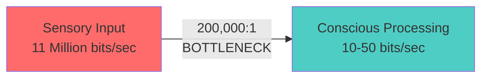
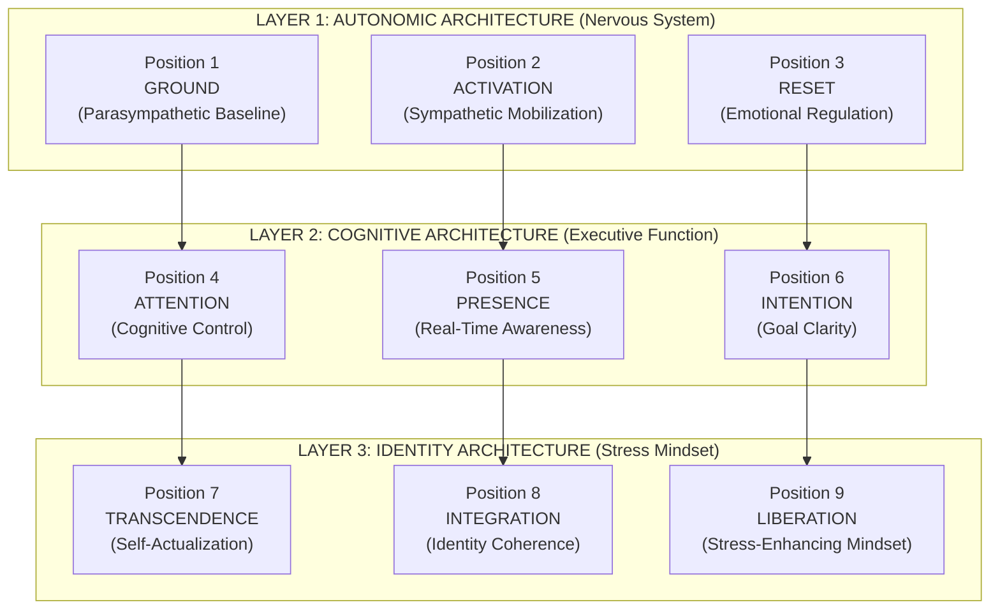
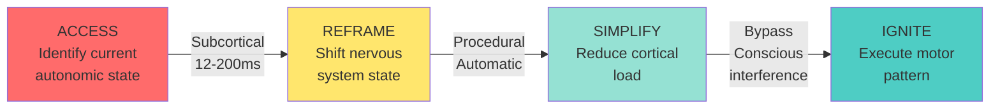
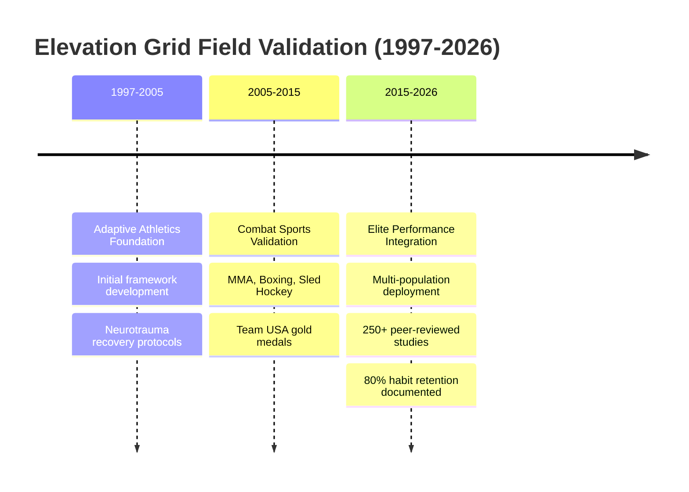
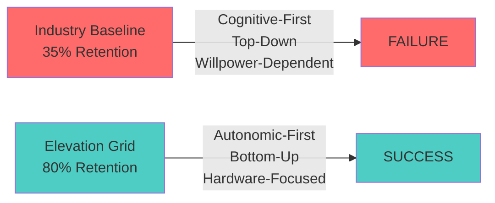
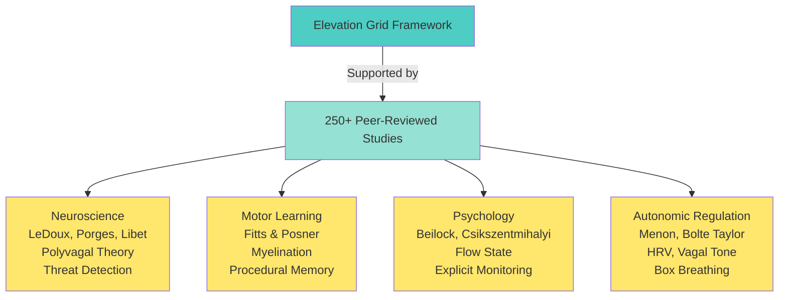

<div class="hero">
  <h1>The Elevation Grid</h1>
  <p class="subtitle">A Neurobiological Framework for High-Stakes Performance Across Adaptive and Elite Populations</p>
  <p class="tagline">28 Years of Validated Performance Optimization</p>
  
  <div class="hero-stats">
    <div class="stat">
      <span class="stat-value">80%</span>
      <span class="stat-label">Habit Retention</span>
      <span class="stat-context">vs. 35% industry baseline</span>
    </div>
    <div class="stat">
      <span class="stat-value">Team USA</span>
      <span class="stat-label">Gold Medals</span>
      <span class="stat-context">2025 Sled Hockey</span>
    </div>
    <div class="stat">
      <span class="stat-value">250+</span>
      <span class="stat-label">Research Studies</span>
      <span class="stat-context">Peer-reviewed foundation</span>
    </div>
  </div>
  
  <div class="cta-buttons">
    <a href="elevation-grid-academic.html" class="btn btn-primary">Read the Paper</a>
    <a href="#framework" class="btn btn-secondary">Explore the Framework</a>
  </div>
</div>

---

## The Problem: Bandwidth, Not Capacity

Most mental performance coaching **fails by violating the bandwidth limits of the nervous system**. While the human sensory system processes approximately **11 million bits of data per second**, conscious executive function operates at fewer than **50 bits per second**—a processing bottleneck of over 200,000:1.

Traditional coaching operates on a **"top-down" model**, attempting to solve bandwidth constraints through cognitive strategies: willpower, positive thinking, goal-setting. This approach systematically degrades under pressure because it ignores the **temporal speed gap** between neural processing systems:



**The subcortical threat response (amygdala) activates in 12-200ms.**  
**The cortical executive response (prefrontal cortex) activates in 300-500ms.**

In high-stakes environments—athletic competition, combat sports, neurotrauma recovery under stress—**the slower executive function is routinely hijacked by faster autonomic reflexes**.

---

## The Solution: Bottom-Up Architecture {#framework}

The Elevation Grid proposes a **bottom-up architecture** that regulates biological signal *before* attempting cognitive intervention.

### The 3×3 Grid System

**9 Positions Across 3 Neural Hierarchies:**



**Bottom-Up Progression:** The system requires stable autonomic regulation (Hardware) before motor pattern refinement (Integration) before cognitive strategy application (Software).

---

## Neural Access Method (NAM)

The **Neural Access Method** is a 4-step protocol that bypasses cortical interference to restore procedural motor execution.



**Validated in stroke recovery and high-pressure performance contexts**, NAM demonstrates **immediate functional restoration in neurotrauma subjects where traditional therapeutic cueing failed**.

---

## Field Validation

### 28-Year Timeline (1997-2026)



### Success Metrics

**Habit Retention Comparison:**



**+45 percentage points improvement (128% increase)**

### Key Populations

**Validated across:**
- **Adaptive Athletics** — Team USA sled hockey gold medals (2025)
- **Neurotrauma Recovery** — Stroke recovery, Chris Oates case study
- **Combat Sports** — MMA, boxing, high-pressure performance
- **Elite Performance** — International competition outcomes

---

## Scientific Foundation



The framework integrates research from:
- **Polyvagal Theory** (Porges, 2011) — Autonomic nervous system regulation
- **Explicit Monitoring Theory** (Beilock & Carr, 2001) — Performance under pressure
- **Temporal Processing** (LeDoux, 1996; Libet, 1983) — Neural speed gaps
- **Motor Learning** (Fitts & Posner, 1967) — Procedural memory access
- **Stress Mindset** (Jamieson et al., 2012) — Identity architecture

---

## Integration with Synoetic OS™

The Elevation Grid serves as the **foundational human performance methodology** within the Synoetic OS™ ecosystem. The framework's neurobiological principles directly inform:

- **Climb to Summit (CTS)** — Mental coaching methodology
- **Identity Architecture** — Stress mindset and self-concept stability  
- **Resource Allocation** — Cognitive bandwidth optimization
- **Recovery Protocols** — Bottom-up restoration after system degradation

The Synoetic OS overlay demonstrates how human performance optimization principles translate to AI system resilience through substrate-independent pattern recognition.

---

## Documentation

<div class="doc-grid">
  <div class="doc-card">
    <h3>📄 White Paper</h3>
    <p>Complete framework specification with 250+ citations</p>
    <a href="elevation-grid-academic.html" class="btn btn-sm">Read Paper</a>
  </div>
  
  <div class="doc-card">
    <h3>🔗 Cross References</h3>
    <p>Connections to other frameworks and research</p>
    <a href="elevation-grid-cross-references.html" class="btn btn-sm">View References</a>
  </div>
  
  <div class="doc-card">
    <h3>📚 Master Bibliography</h3>
    <p>250+ peer-reviewed studies organized by topic</p>
    <a href="elevation-grid-master-bibliography.html" class="btn btn-sm">Browse Studies</a>
  </div>
  
  <div class="doc-card">
    <h3>📊 Visualizations</h3>
    <p>Interactive diagrams and charts</p>
    <a href="elevation-grid-visualizations.html" class="btn btn-sm">Explore Visuals</a>
  </div>
  
  <div class="doc-card">
    <h3>🔄 Synoetic OS Overlay</h3>
    <p>AI system translation and integration</p>
    <a href="overlays/elevation-grid-synoetic-overlay.html" class="btn btn-sm">View Overlay</a>
  </div>
  
  <div class="doc-card">
    <h3>⛰️ CTS Overlay</h3>
    <p>Climb to Summit integration</p>
    <a href="overlays/elevation-grid-cts-overlay.html" class="btn btn-sm">View Overlay</a>
  </div>
</div>

---

## Citation

### BibTeX

```bibtex
@article{slusher2026elevationgrid,
  title={The Elevation Grid: A Neurobiological Framework for High-Stakes Performance Across Adaptive and Elite Populations},
  author={Slusher, Aaron M.},
  journal={Achieve Peak Performance White Papers},
  year={2026},
  doi={TBD},
  url={https://valorgridsolutions.github.io/synoeticos-public/elevation-grid/}
}
```

### APA

Slusher, A. M. (2026). *The Elevation Grid: A Neurobiological Framework for High-Stakes Performance Across Adaptive and Elite Populations*. Achieve Peak Performance White Papers. TBD

---

## About the Author

**Aaron M. Slusher**  
**ORCID:** [0009-0000-9923-3207](https://orcid.org/0009-0000-9923-3207)

28-year performance coaching career (1997-2026) specializing in adaptive athletics, neurotrauma recovery, and high-stakes performance optimization. Founder of Achieve Peak Performance (1999) and co-founder of Achieve Performance Institute (501c3 nonprofit, 2022).

**43 Professional Certifications** spanning performance coaching, movement therapy, mental skills training, and adaptive athletics including:
- Mental Performance Mastery (Brian Cain, 2022)
- Rehab-U Movement Performance Levels 1-2 (2024)
- Precision Nutrition Level 2 Behavior Change Specialist (2016)
- Adaptive Inclusive Trainer Level 2 (2024)

**Contact:**  
[aaron@achievepeakperformance.net](mailto:aaron@achievepeakperformance.net)  
[achievepeakperformance.net](https://achievepeakperformance.net)

---

## License

**Dual Licensing Model:**

**Option 1: CC BY-NC 4.0** (Non-commercial)  
For academic research, educational purposes, and non-commercial applications.  
[Full License](https://creativecommons.org/licenses/by-nc/4.0/)

**Option 2: Commercial Enterprise License**  
For commercial deployment, enterprise integration, or revenue-generating applications.  
Contact: [aaron@achievepeakperformance.net](mailto:aaron@achievepeakperformance.net)

**Patent Clause:** No patents filed — rights granted under license terms; good-faith implementations protected from retroactive patent claims by licensor.

---

<div class="footer-cta">
  <p><strong>Part of the Synoetic OS™ ecosystem</strong></p>
  <p>Building resilient systems through neurobiological validation</p>
  <p class="copyright">© 2026 Aaron M. Slusher, Achieve Peak Performance. All rights reserved.</p>
</div>
